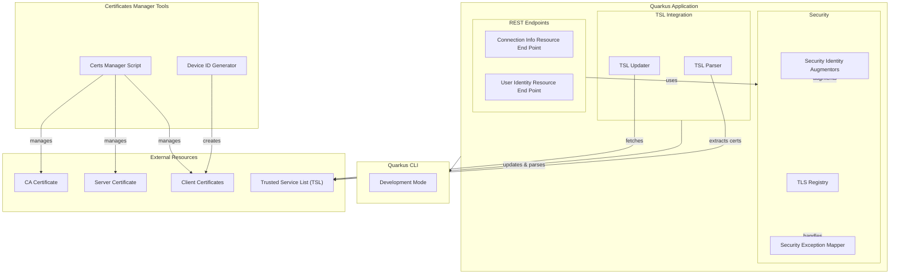

# Tutorial Project for Quarkus Mutual TLS (mTLS) Authentication POC

[](CHANGELOG.md)
[](https://opensource.org/licenses/MIT)
[](CODE_OF_CONDUCT.md)


This tutorial project is linked to the article [Implementazione di TLS Mutual Authentication (mTLS) con Quarkus](https://bit.ly/3MQPA3v) published on Antonio Musarra Blog. To use the project properly I therefore recommend you read the article that will guide you step by step.

## Container Images

| Image                                        | Latest Tag                                                                                                                     | Repository Link                                                                   | Pull Command                                                                                                                                                                                                 |
|----------------------------------------------|--------------------------------------------------------------------------------------------------------------------------------|-----------------------------------------------------------------------------------|--------------------------------------------------------------------------------------------------------------------------------------------------------------------------------------------------------------|
| `amusarra/quarkus-mtls-auth`        |         | [Docker Hub](https://hub.docker.com/r/amusarra/quarkus-mtls-auth)        | Pull the latest version `docker pull amusarra/quarkus-mtls-auth:latest`                                                                                                                             |

> Remember that to use the podman command, you need to replace `docker` with `podman`. Also remember that the pattern for the version of the image is `latest` or `develop`; you can replace `latest` with the desired version: `1.0.0`, `1.0.1`, or the branch name (main, develop, etc.) For example, `docker pull amusarra/quarkus-mtls-auth:develop`, referer to the develop branch of the project.

For more information about the tags available, please visit the Docker Hub repository.

## Architecture Overview

The `tls-mutual-auth` project is a Quarkus-based application designed to demonstrate the implementation of Mutual TLS (mTLS) authentication. This document provides a high-level overview of the project's architecture, key components, and their interactions.

The diagram below illustrates the main components and their relationships within the `tls-mutual-auth` project.



Components and their interactions in the `tls-mutual-auth` project.

### Codebase Structure

The project is structured into several key directories and files:

- `src/main/java/`: Contains all Java source files organized by package.
- `src/main/resources/`: Includes application properties and other resources necessary for the application configuration.
- `src/test/java/`: Houses the test cases for the application.
- `src/main/docker/`: Contains Docker-related files, including Dockerfiles and configuration scripts.
- `pom.xml`: Maven configuration file that manages dependencies, plugins, and other project-specific configurations.

### Key Components

#### 1. **TLS Configuration**

The TLS settings are managed through the Quarkus framework, leveraging the `application.properties` file located in `src/main/resources/`. This file specifies the server's certificate, the required client certificate for mTLS, and other TLS-related settings.

#### 2. **Resource Endpoints**

The application exposes REST endpoints defined in the `it.dontesta.quarkus.tls.auth.ws.resources.endpoint.v1` package. These endpoints provide functionalities to retrieve connection information and user identity details, demonstrating how client certificates can be used within an mTLS secured application.

#### 3. **Security Configuration**

Security settings are handled through Quarkus security extensions. The project defines custom security augmentors in the `it.dontesta.quarkus.tls.auth.ws.security.identity` package to extract roles and attributes from the client certificate. These augmentors help in enforcing security policies based on the certificate details.

#### 4. **Certificate Management**

Scripts located in `src/main/shell/certs-manager/` assist in generating and managing certificates required for mTLS. These include scripts for creating a Certificate Authority (CA), server certificates, and client certificates with specific attributes.

#### 5. **Tests**

Unit and integration tests are located in `src/test/java/`. These tests ensure that the application behaves as expected under various scenarios, particularly focusing on the security aspects and proper handling of client certificates.

### Architectural Invariants

- **mTLS Requirement:** The application mandates mutual TLS for all interactions, ensuring that both the client and the server are authenticated using certificates.
- **Certificate Validation:** All client certificates are validated against the CA certificate configured in the server's trust store.
- **Role-Based Access Control (RBAC):** Access to specific endpoints is controlled based on roles extracted from the client certificate.

### Boundaries and Interfaces

- **REST API Boundary:** The `ConnectionInfoResourceEndPoint` class defines the boundary for the REST API. It handles incoming HTTP requests and interacts with the security layer to authenticate requests.
- **Security Layer:** Interfaces with the Quarkus security framework to implement custom logic for extracting and validating certificate attributes.
- **Certificate Management Scripts:** These scripts operate outside the Java application but are crucial for setting up and managing the TLS environment necessary for mTLS.

### Conclusion

This architecture document outlines the high-level structure and components of the `tls-mutual-auth` project. By understanding the key elements and their interactions, developers can navigate the codebase effectively and contribute to the project with a clear understanding of how mTLS is implemented and managed within a Quarkus application.

This project uses Quarkus, the Supersonic Subatomic Java Framework.

If you want to learn more about Quarkus, please visit its website: <https://quarkus.io/>.

## Requirement for build

To build this project successfully, you need the following requirements:

- **Java Development Kit (JDK) 21**  
  The project is based on Quarkus and requires at least JDK 21. You can use [Eclipse Temurin](https://adoptium.net/) or [OpenJDK](https://openjdk.org/).
- **Maven 3.9.x**  
  The build is managed with Maven. Make sure you have Maven 3.9.x installed. You can use the included `mvnw` wrapper if you don't want to install Maven globally.
- **OpenSSL >= 3.0.7**  
  Some build steps (especially certificate generation and native builds) require OpenSSL version 3.0.7 or newer.  
  You can check your version with:

  ```shell
  openssl version
  ```

  If your system does not provide a recent enough version, consider using a container image or updating your OS packages.
- **xmlstarlet >= 1.6.x**  
  Required for XML processing in some scripts.  
  You can check your version with:
  
  ```shell
  xmlstarlet --version
  ```

- **Bash >= 5**  
  Some scripts require Bash version 5 or newer.  
  You can check your version with:

  ```shell
  bash --version
  ```

- **GNU/Linux, macOS, or Windows**  
  The project is cross-platform, but for scripting and automation (certificate generation, etc.) a Unix-like environment is recommended.
- **Docker or Podman (optional)**  
  Required only if you want to build and run the container images or use native builds in containers.

## Running the application in dev mode

You can run your application in dev mode that enables live coding using:

```shell script
./mvnw compile quarkus:dev
```

> 🛎️ **_NOTE:_**  Quarkus now ships with a Dev UI, which is available in dev mode only at <http://localhost:8080/q/dev/>.

> ⚠️ **_WARNING:_**  with the current configuration of the application, it's listening only on HTTPS port 8443. You need to configure your browser to accept the self-signed certificate used by the server. The Dev UI is available at <https://localhost:8443/q/dev/>.

Out of the box (OOTB), the application is configured with the default self-signed certificates. You can find the principal certificates in the `src/main/resources/certs` directory:

1. `ca_cert.[pem,p12]`: Certificate Authority (CA) certificate;
2. `server_cert.[pem, p12]`: Server certificate.

The path of the certificates can be changed in the `application.properties` file and in particular the password of the server certificate. The default configuration is:

1. `quarkus.tls.https.key-store.p12.path=certs/server_cert.p12`
2. `quarkus.tls.https.key-store.p12.password=changeit=<ootb-generated-password>`
3. `quarkus.tls.https.trust-store.pem.certs=certs/ca_cert.pem,/tmp/tsl-it/tsl-it_bundle.pem`

With the above configuration, the application will start with the default self-signed certificates without any issues. Below is an asciinema recording of the application running in dev mode.

[](https://asciinema.org/a/AXCFc2ugDJTISRU6SG86l5Ihg)

If you want to use your certificates, you need to change the configuration in the `application.properties` file and replace the certificates in the `src/main/resources/certs` directory.

If you want to generate the new certificates, you can use the following command:

1. Clean the OOTB certificates: `./mvnw exec:exec@generate-cert-clean`
2. Generate the new CA certificate: `./mvnw exec:exec@generate-ca-certificate`
3. Generate the new Server certificate: `./mvnw exec:exec@generate-server-certificate`

🛎️ The step 2 and 3, you can skip because when you run the application in dev mode, the certificates are generated automatically.

For more information about the certificates, you can refer to the article [Implementazione di TLS Mutual Authentication (mTLS) con Quarkus](https://bit.ly/3MQPA3v).

## Packaging and running the application

The application can be packaged using:

```shell script
./mvnw package
```

It produces the `quarkus-run.jar` file in the `target/quarkus-app/` directory.
Be aware that it’s not an _über-jar_ as the dependencies are copied into the `target/quarkus-app/lib/` directory.

The application is now runnable using `java -jar target/quarkus-app/quarkus-run.jar`.

If you want to build an _über-jar_, execute the following command:

```shell script
./mvnw package -Dquarkus.package.jar.type=uber-jar
```

The application, packaged as an _über-jar_, is now runnable using `java -jar target/*-runner.jar`.

## Creating a native executable

In this case, to create a native executable, with the support of SSL/TLS, you need read the [Using SSL With Native Executables](https://quarkus.io/guides/native-and-ssl) guide first and then you can create a native executable.

You can create a native executable using:

```shell script
./mvnw package -Dnative
```

Or, if you don't have GraalVM installed, you can run the native executable build in a container using:

```shell script
./mvnw package -Dnative -Dquarkus.native.container-build=true
```

You can then execute your native executable with: `./target/tls-mutual-auth-1.0.0-SNAPSHOT-runner`

If you want to learn more about building native executables, please consult <https://quarkus.io/guides/maven-tooling>.

## Quickstart

If you are curious and want to see the application running immediately, you can use the pre-built container image available on Docker Hub. This allows you to test the application without building it locally.

```shell
# Pull the latest image from Docker Hub
docker pull amusarra/quarkus-mtls-auth:latest

# Run the container
docker run -p 8443:8443 amusarra/quarkus-mtls-auth:latest
```

You can also use Podman, which is a drop-in replacement for Docker. Just replace `docker` with `podman` in the commands above.

The application will be available on `https://localhost:8443`.  
Remember to accept the self-signed certificate in your browser or API client.

For more details on available tags and usage, visit [Docker Hub](https://hub.docker.com/r/amusarra/quarkus-mtls-auth).

## Related Guides

- Eclipse Vert.x ([guide](https://quarkus.io/guides/vertx)): Write reactive applications with the Vert.x API
- ArC ([guide](https://quarkus.io/guides/cdi-reference)): Build time CDI dependency injection
- REST ([guide](https://quarkus.io/guides/rest)): A Jakarta REST implementation utilizing build time processing and Vert.x. This extension is not compatible with the quarkus-resteasy extension, or any of the extensions that depend on it.
- REST Jackson ([guide](https://quarkus.io/guides/rest#json-serialisation)): Jackson serialization support for Quarkus REST. This extension is not compatible with the quarkus-resteasy extension, or any of the extensions that depend on it

## Team Tools

Antonio Musarra's Blog Team would like inform that JetBrains is helping by provided IDE to develop the application. Thanks to its support [program for an Open Source projects](https://www.jetbrains.com/community/opensource/) !


