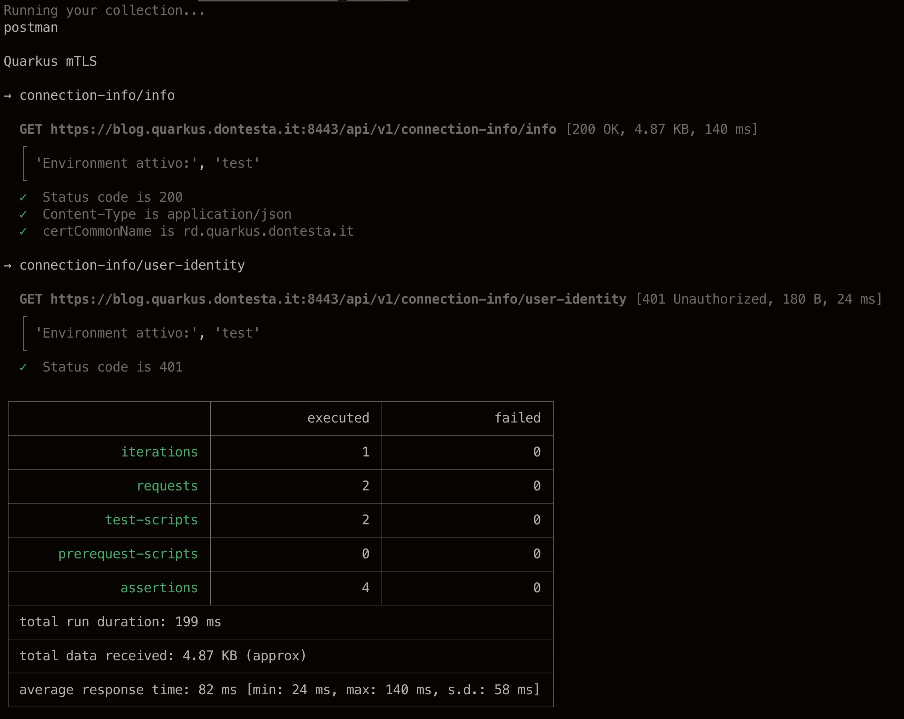
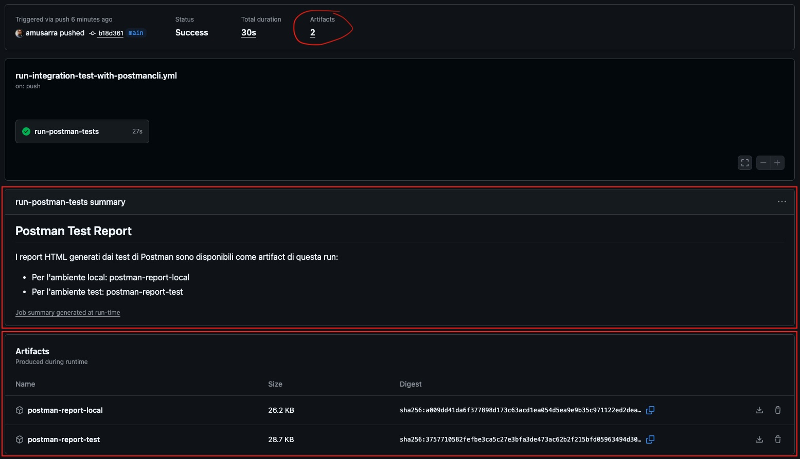
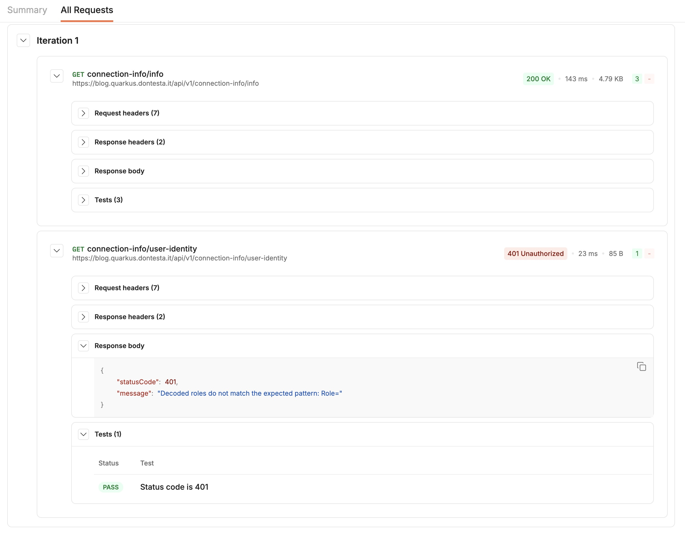

## Cronologia delle revisioni

| Versione | Data       | Autore          | Descrizione delle Modifiche                                                             |
|:---------|:-----------|:----------------|:----------------------------------------------------------------------------------------|
| 1.0.0    | 2025-09-02 | Antonio Musarra | Prima release                                                                           |

[TOC]

<div style="page-break-after: always; break-after: page;"></div>

L'obiettivo di questa guida è mostrare come testare endpoint REST protetti da mTLS ([Mutual TLS](https://en.wikipedia.org/wiki/Mutual_authentication)), come quelli del progetto [quarkus-mtls-auth](https://github.com/amusarra/quarkus-mtls-auth), attraverso l'utilizzo della [Postman CLI](https://learning.postman.com/docs/postman-cli/postman-cli-overview/).

Vedremo come sfruttare gli ambienti per una configurazione flessibile e come gestire più certificati client in modo centralizzato tramite un file di configurazione, una pratica essenziale quando si lavora con diversi servizi.

La documentazione ufficiale di Postman CLI non fornisce informazioni dettagliate su come configurare mTLS, ne quanto meno esempi pratici. Seguendo questa guida, **ti assicuro che sarà un gioco da ragazzi!**

> **Segui la guida fino in fondo!**  
> Alla fine troverai un bonus: il link al repository GitHub che contiene l'intero progetto pronto all'uso, con tutte le configurazioni, gli script e le collection Postman illustrate in questo articolo.

## Prerequisiti

Per seguire questa guida, assicuriamoci di avere:

- [Postman CLI](https://learning.postman.com/docs/postman-cli/postman-cli-installation/) installato sull'ambiente di esecuzione. Versione minima consigliata: 1.18.0, poiché alcune funzionalità potrebbero non essere disponibili nelle versioni precedenti;
- un progetto con endpoint protetti da mTLS, come per esempio [quarkus-mtls-auth](https://github.com/amusarra/quarkus-mtls-auth);
- certificati client e CA ([Certificate Authority](https://en.wikipedia.org/wiki/Certificate_authority)) necessari per l'autenticazione mTLS.

> Il login su Postman non è necessario per eseguire collection locali come in questo esempio, ma è richiesto nel caso in cui si voglia sincronizzare collection, ambienti o cronologia con il cloud di Postman.

Il progetto [quarkus-mtls-auth](https://github.com/amusarra/quarkus-mtls-auth) offre un'implementazione di API REST protette dal meccanismo di sicurezza mTLS, che utilizzeremo per dimostrare la configurazione di Postman CLI. Quanto descritto in questa guida è applicabile a qualsiasi altro progetto e/o scenario simile.

Per quanto riguarda i certificati client e CA, esploreremo in seguito come generarli e configurarli correttamente in Postman CLI. La versione CLI, a differenza della versione Desktop, attualmente supporta solo certificati in formato PEM ([Privacy Enhanced Mail](https://en.wikipedia.org/wiki/Privacy-Enhanced_Mail)).

Non ci sono restrizioni particolari riguardo il sistema operativo utilizzato, puoi seguire questa guida su Windows, macOS o Linux senza problemi. Per garantire la massima compatibilità, consiglio di utilizzare un terminale con supporto per i comandi Unix/Linux.

Per seguire in modo fluido questa guida, assicurati di avere familiarità con i concetti di base di mTLS e Postman e avere una certa dimestichezza con la linea di comando e il formato JSON.

<div style="page-break-after: always; break-after: page;"></div>

## Configurazione della struttura del progetto

Come primo passo, organizziamo un ambiente di lavoro che sia agevole e ben strutturato per Postman CLI. Inizieremo creando una cartella dedicata al nostro progetto e all'interno di essa, andremo a creare tutto il necessario per la configurazione.

```shell
# Creiamo la struttura delle cartelle
# La directory di lavoro (o root directory) sarà postman-mtls
mkdir postman-mtls

# Creiamo la cartella per i certificati client
mkdir -p postman-mtls/certificates/client

# Creiamo la cartella per i certificati CA
mkdir -p postman-mtls/certificates/ca

# Creiamo la cartella per la collection postman
mkdir postman-mtls/collections

# Creiamo la cartella per i file di configurazione (environments)
mkdir -p postman-mtls/config/environments

# Creiamo la cartella per i file di configurazione (certificates)
mkdir -p postman-mtls/config/certificates
```

Console 1 - Creazione della struttura delle cartelle per il progetto Postman mTLS

Una volta eseguiti i comandi precedenti, la struttura delle cartelle dovrebbe apparire come segue.

```shell
postman-mtls/
├── certificates/
│   ├── client/
│   └── ca/
├── collections/
└── config/
    ├── environments/
    └── certificates/
```

Console 2 - Verifica della struttura delle cartelle (uso del comando `tree`)

<div style="page-break-after: always; break-after: page;"></div>

## Configurazione delle variabili d'ambiente di Postman

Usare le [variabili d'ambiente in Postman](https://learning.postman.com/docs/sending-requests/variables/managing-environments/) è fondamentale per gestire configurazioni diverse senza modificare manualmente le richieste. Le variabili possono essere utilizzate per memorizzare valori come URL, token di accesso e certificati.

Per il nostro esempio, creeremo due ambienti: uno per lo sviluppo locale e un altro per l'ambiente di test. Vediamo quali sono le variabili che andremo a definire:

- `base_url`: l'URL di base del servizio. Questa variabile avrà un valore differente per ogni ambiente;
- `api_connection_info_path`: il path dell'API per le informazioni di connessione;
- `api_connection_user_identity`: il path dell'API per l'identità dell'utente;
- `env_name`: il nome dell'ambiente. È utile per identificare l'ambiente attivo durante l'esecuzione delle richieste e dei test.

La tabella a seguire riassume le variabili per ciascun ambiente.

| Variabile                   | Ambiente local                      | Ambiente test                                 | Descrizione                                   |
|-----------------------------|-------------------------------------|-----------------------------------------------|-----------------------------------------------|
| `env_name`                  | local                               | test                                          | Nome identificativo dell'ambiente             |
| `base_url`                  | <https://localhost:8443>              | <https://blog.quarkus.dontesta.it:8443>         | URL di base del servizio                      |
| `api_connection_info_path`  | /api/v1/connection-info/info        | /api/v1/connection-info/info                  | Path API per informazioni di connessione      |
| `api_connection_user_identity` | /api/v1/connection-info/user-identity | /api/v1/connection-info/user-identity     | Path API per identità utente                  |

Tabella 1 - Variabili per gli ambienti

Queste variabili possono essere definite e create dall'interfaccia di Postman o tramite file di configurazione JSON. Noi faremo a meno dell'interfaccia grafica e utilizzeremo file di configurazione JSON per definire i nostri ambienti.

Andremo a creare due file JSON, uno per l'ambiente di sviluppo locale e uno per l'ambiente di test. Questi file conterranno le variabili necessarie per ciascun ambiente. Chiameremo i file `local.json` e `test.json` che andranno posizionati nella cartella `postman-mtls/config/environments`.

```shell
# Creiamo i file di configurazione per gli ambienti
touch postman-mtls/config/environments/local.json
touch postman-mtls/config/environments/test.json
```

Console 3 - Creazione dei file di configurazione per gli ambienti.

<div style="page-break-after: always; break-after: page;"></div>

Il contenuto del file `local.json` sarà il seguente.

```json
{
    "id": "quarkus-mtls-local-environment",
    "name": "Quarkus mTLS local environment",
    "values": [
        {
            "key": "env_name",
            "value": "local",
            "description": "Name of the environment",
            "type": "default",
            "enabled": true
        },
        {
            "key": "base_url",
            "value": "https://localhost:8443",
            "description": "Base URL for the local environment",
            "type": "default",
            "enabled": true
        },
        {
            "key": "api_connection_info_path",
            "value": "/api/v1/connection-info/info",
            "description": "Path for API connection info",
            "type": "default",
            "enabled": true
        },
        {
            "key": "api_connection_user_identity",
            "value": "/api/v1/connection-info/user-identity",
            "description": "Path for API user identity",
            "type": "default",
            "enabled": true
        }
    ]
}
```

Config. 1 - Configurazione variabili per l'ambiente locale.

<div style="page-break-after: always; break-after: page;"></div>

Per l'ambiente di test il contenuto del file `test.json` sarà il seguente.

```json
{
    "id": "quarkus-mtls-test-environment",
    "name": "Quarkus mTLS test environment",
    "values": [
        {
            "key": "env_name",
            "value": "test",
            "description": "Name of the environment",
            "type": "default",
            "enabled": true
        },
        {
            "key": "base_url",
            "value": "https://blog.quarkus.dontesta.it:8443",
            "description": "Base URL for the test environment",
            "type": "default",
            "enabled": true
        },
        {
            "key": "api_connection_info_path",
            "value": "/api/v1/connection-info/info",
            "description": "Path for API connection info",
            "type": "default",
            "enabled": true
        },
        {
            "key": "api_connection_user_identity",
            "value": "/api/v1/connection-info/user-identity",
            "description": "Path for API user identity",
            "type": "default",
            "enabled": true
        }
    ]
}
```

Config. 2 - Configurazione variabili per l'ambiente di test.

> **Importante**: come `base_url` per l'ambiente di test abbiamo indicato l'FQDN `blog.quarkus.dontesta.it`, dobbiamo quindi assicurarci che questo sia risolvibile. In questo caso è più che sufficiente aggiungere una voce nel file `/etc/hosts` del nostro ambiente di sviluppo.

Una volta creati i file di configurazione per gli ambienti, possiamo procedere con la configurazione dei certificati client che saranno usati dalla CLI di Postman per eseguire le richieste HTTPS verso i servizi.

<div style="page-break-after: always; break-after: page;"></div>

## Configurazione dei certificati client in Postman CLI

La configurazione dei certificati client in Postman CLI è un passaggio cruciale per l'autenticazione mTLS. A differenza della versione Desktop di Postman, che consente di [configurare i certificati tramite l'interfaccia grafica](https://learning.postman.com/docs/sending-requests/authorization/certificates/), la CLI richiede l'uso di file di configurazione JSON.

Per gestire più certificati client in modo centralizzato, creeremo un file di configurazione adatto allo scopo. Questo file conterrà le informazioni necessarie per ogni certificato, inclusi i percorsi dei file PEM per il certificato e la chiave privata, compresa la relativa passphrase.

Chiameremo questo file di configurazione `client-certificates.json` e lo posizioneremo nella cartella `postman-mtls/config/certificates`.

A seguire l'esempio di configurazione per i certificati client. In questo caso, abbiamo configurato due certificati, sia per l'ambiente locale che per l'ambiente di test. Questa configurazione è solo un esempio e può essere adattata in base alle esigenze specifiche.

```json
[
  {
    "name": "local-certificate-1",
    "matches": ["https://localhost:8443/api/v1/connection-info/info"],
    "key": { "src": "certificates/client/client_with_device_id_and_roles_key.pem" },
    "cert": { "src": "certificates/client/client_with_device_id_and_roles_cert.pem" },
    "passphrase": "pZAXwq+l1BRlC+3X"
  },
  {
    "name": "local-certificate-2",
    "matches": ["https://localhost:8443/api/v1/connection-info/user-identity"],
    "key": { "src": "certificates/client/client_with_device_id_and_roles_1_key.pem" },
    "cert": { "src": "certificates/client/client_with_device_id_and_roles_1_cert.pem" },
    "passphrase": "z93Fl8nhQR8shWTq"
  },
  {
    "name": "test-certificate-1",
    "matches": ["https://blog.quarkus.dontesta.it:8443/api/v1/connection-info/user-identity"],
    "key": { "src": "certificates/client/client_new_device_id_key.pem" },
    "cert": { "src": "certificates/client/client_new_device_id_cert.pem" },
    "passphrase": "4l0nJ9nvreqleFnV"
  },
  {
    "name": "test-certificate-2",
    "matches": ["https://blog.quarkus.dontesta.it:8443/api/v1/connection-info/info"],
    "key": { "src": "certificates/client/client_with_device_id_and_roles_1_key.pem" },
    "cert": { "src": "certificates/client/client_with_device_id_and_roles_1_cert.pem" },
    "passphrase": "z93Fl8nhQR8shWTq"
  }
]
```

Config. 3 - Configurazione dei certificati client per mTLS.

Poiché il progetto su cui eseguiremo i test è [quarkus-mtls-auth](https://github.com/amusarra/quarkus-mtls-auth), utilizzeremo certificati accettati dai servizi REST implementati in questo progetto. I certificati indicati sono stati generati appositamente per il testing tramite uno script specifico.

Per maggiori informazioni su come sono stati generati i certificati client, fare riferimento all'articolo [Implementazione di TLS Mutual Authentication (mTLS) con Quarkus](https://www.dontesta.it/2024/09/19/implementazione-tls-mutual-authentication-mtls-con-quarkus/) e in particolare al capitolo **Step 10 - Generazione di un set di certificati client per eseguire dei test di accesso**.

### Come Postman CLI seleziona il certificato client

Quando si esegue una collection con Postman CLI e si specifica il file di configurazione dei certificati tramite l'opzione `--ssl-client-cert-list`, Postman seleziona automaticamente il certificato client da utilizzare per ogni richiesta HTTPS in base al campo `matches` presente nel file di configurazione.

Il campo `matches` è un array di URL o pattern che indicano a quali richieste il certificato deve essere associato. Durante l'esecuzione della collection, Postman confronta l'URL della richiesta con i valori definiti in `matches` per determinare quale certificato utilizzare.  

- Se l'URL della richiesta corrisponde a uno dei valori definiti in `matches`, Postman utilizza il certificato associato a quella configurazione.
- Se nessun certificato corrisponde, la richiesta sarà inviata senza certificato client.

Questo meccanismo consente di gestire facilmente più certificati per diversi endpoint o ambienti, senza dover modificare manualmente la configurazione ad ogni esecuzione.

Esempio: se una richiesta viene inviata a `https://localhost:8443/api/v1/connection-info/info`, Postman CLI cercherà una configurazione con `matches` che includa esattamente quell'URL e userà il certificato specificato.

Per maggiori dettagli fare riferimento ad [Add and manage CA and client certificates in Postman](https://learning.postman.com/docs/sending-requests/authorization/certificates/)

<div style="page-break-after: always; break-after: page;"></div>

## Creazione della collection Postman

A questo punto possiamo creare la nostra collection Postman contenente le richieste necessarie per interagire con le API protette da mTLS, che in questo caso sono due: `/api/v1/connection-info/info`e `/api/v1/connection-info/user-identity`. La prima API restituisce informazioni sulla connessione, mentre la seconda fornisce dettagli sull'identità dell'utente.

Procediamo ora con la creazione del file JSON della collection, che salveremo nella cartella `postman-mtls/collections` con il nome `quarkus-mtls-collection.json`. Di seguito è riportato il contenuto del file.

```json
{
    "info": {
        "name": "Quarkus mTLS",
        "description": "Collection Postman per il test di servizi REST protetti da un meccanismo di sicurezza di tipo mTLS.",
        "schema": "https://schema.getpostman.com/json/collection/v2.1.0/collection.json"
    },
    "item": [
        {
            "name": "connection-info/info",
            "request": {
                "method": "GET",
                "header": [],
                "url": {
                    "raw": "{{base_url}}{{api_connection_info_path}}",
                    "host": [
                        "{{base_url}}{{api_connection_info_path}}"
                    ]
                },
                "description": "La risposta del servizio conterrà un set d'informazioni che riguardano la connessione instaurata."
            },
            "response": []
        },
        {
            "name": "connection-info/user-identity",
            "request": {
                "method": "GET",
                "header": [],
                "url": {
                    "raw": "{{base_url}}{{api_connection_user_identity}}",
                    "host": [
                        "{{base_url}}{{api_connection_user_identity}}"
                    ]
                },
                "description": "La risposta del servizio conterrà un set d'informazioni che riguardano l'indentità del client che ha richiesto l'accesso alla risorsa."
            },
            "response": []
        }
    ]
}
```

Config. 4 - Creazione della collezione Postman per mTLS.

All'interno della collection abbiamo utilizzato le variabili definite nell'ambiente, come per esempio `base_url`, `api_connection_info_path` e `api_connection_user_identity`.

Vogliamo rendere la nostra collection ancora più "smart" per il testing automatizzato! Per farlo, aggiungeremo dei test alle richieste, così ogni ambiente avrà i suoi controlli dedicati. Immagina: ogni volta che lanci la collection, Postman CLI si trasforma in un vero e proprio "detective" delle API, pronto a scovare errori e confermare che tutto funzioni come previsto. La tabella qui sotto mostra quali test saranno eseguiti per ogni richiesta, a seconda dell'ambiente attivo. Pronti a scoprire chi supera l’esame?

| Richiesta                        | Ambiente | Test eseguiti                                                                                           |
|-----------------------------------|----------|---------------------------------------------------------------------------------------------------------|
| connection-info/info              | local    | - Status code = 403                                                                                     |
| connection-info/info              | test     | - Status code = 200<br>- Content-Type = application/json;charset=UTF-8<br>- certCommonName = rd.quarkus.dontesta.it |
| connection-info/user-identity     | local    | - Status code = 200<br>- Content-Type = application/json;charset=UTF-8<br>- deviceId corretto           |
| connection-info/user-identity     | test     | - Status code = 401                                                                                     |

Tabella 2 - Test automatizzati per ogni richiesta e ambiente

Con riferimento alla tabella precedente, possiamo ora implementare i test all'interno della nostra collezione Postman. A seguire la nuova collection a cui daremo il nome `quarkus-mtls-collection-with-test.json` e posizioneremo sempre in `postman-mtls/collections`.

La sezione "event" di ogni richiesta conterrà gli script per l'esecuzione dei test. Gli script di test sono scritti in JavaScript e utilizzano l'API di test di Postman. Per maggiori approfondimenti fare riferimento alla documentazione ufficiale di Postman [Write scripts to test API response data in Postman](https://learning.postman.com/docs/tests-and-scripts/write-scripts/test-scripts/).

```json
{
    "info": {
        "name": "Quarkus mTLS",
        "description": "Collection Postman per il test di servizi REST protetti da un meccanismo di sicurezza di tipo mTLS.",
        "schema": "https://schema.getpostman.com/json/collection/v2.1.0/collection.json"
    },
    "item": [
        {
            "name": "connection-info/info",
            "request": {
                "method": "GET",
                "header": [],
                "url": {
                    "raw": "{{base_url}}{{api_connection_info_path}}",
                    "host": [
                        "{{base_url}}{{api_connection_info_path}}"
                    ]
                },
                "description": "La risposta del servizio conterrà un set d'informazioni che riguardano la connessione instaurata."
            },
            "event": [
                {
                    "listen": "test",
                    "script": {
                        "type": "text/javascript",
                        "exec": [
                            "console.log('Environment attivo:', pm.environment.get('env_name'));",
                            "if (pm.environment.get('env_name') === 'local') {",
                            "    pm.test('Status code is 403', function () {",
                            "        pm.response.to.have.status(403);",
                            "    });",
                            "} else if (pm.environment.get('env_name') === 'test') {",
                            "    pm.test('Status code is 200', function () {",
                            "        pm.response.to.have.status(200);",
                            "    });",
                            "    pm.test('Content-Type is application/json', function () {",
                            "        pm.response.to.have.header('Content-Type', 'application/json;charset=UTF-8');",
                            "    });",
                            "    pm.test('certCommonName is rd.quarkus.dontesta.it', function () {",
                            "        var jsonData = pm.response.json();",
                            "        pm.expect(jsonData.server.certCommonName).to.eql('rd.quarkus.dontesta.it');",
                            "    });",
                            "}"
                        ]
                    }
                }
            ],
            "response": []
        },
        {
            "name": "connection-info/user-identity",
            "request": {
                "method": "GET",
                "header": [],
                "url": {
                    "raw": "{{base_url}}{{api_connection_user_identity}}",
                    "host": [
                        "{{base_url}}{{api_connection_user_identity}}"
                    ]
                },
                "description": "La risposta del servizio conterrà un set d'informazioni che riguardano l'indentità del client che ha richiesto l'accesso alla risorsa."
            },
            "event": [
                {
                    "listen": "test",
                    "script": {
                        "type": "text/javascript",
                        "exec": [
                            "console.log('Environment attivo:', pm.environment.get('env_name'));",
                            "if (pm.environment.get('env_name') === 'local') {",
                            "    pm.test('Status code is 200', function () {",
                            "        pm.response.to.have.status(200);",
                            "    });",
                            "    pm.test('Content-Type is application/json', function () {",
                            "        pm.response.to.have.header('Content-Type', 'application/json;charset=UTF-8');",
                            "    });",
                            "    pm.test('deviceId is valid', function () {",
                            "        var jsonData = pm.response.json();",
                            "        pm.expect(jsonData.attributes.deviceId).to.eql('MTc1NzAyNTE3OTk3MDAwODAwMCM1MjQwOGJkNC1hZjQzLTQwZjYtODgxZi00YWNjOTQ4OTM3MjEjYW11c2FycmEtbWFjYm9vay1wcm8ubG9jYWwjMmVlNjA0Y2IyYzQ1Yjk0NDkwZDhmOWZiYTU4MTEwNjhkNDk1MmUwNjlkMzRmMzc0MjA5ODAzZmNjMjQ5ZWIxOA==');",
                            "    });",
                            "} else if (pm.environment.get('env_name') === 'test') {",
                            "    pm.test('Status code is 401', function () {",
                            "        pm.response.to.have.status(401);",
                            "    });",
                            "}"
                        ]
                    }
                }
            ],
            "response": []
        }
    ]
}
```

Config. 5 - Aggiunta di test alla collection Postman

Ottimo lavoro! Ora che tutte le configurazioni sono pronte (ambienti, certificati e collection Postman sia con che senza test), siamo davvero a un passo dall'esecuzione pratica delle collection. Manca solo l’ultimo step: vedere tutto in azione!

<div style="page-break-after: always; break-after: page;"></div>

## Esecuzione della collection con Postman CLI

Arrivati a questo punto, la struttura del nostro progetto dovrebbe essere simile a quella indicata a seguire.

```shell
postman-mtls/
├── certificates
│   ├── ca
│   │   └── ca_cert.pem
│   └── client
│       ├── client_new_device_id_cert.pem
│       ├── client_new_device_id_key.pem
│       ├── client_new_device_id_key.pem.password
│       ├── client_with_device_id_and_roles_1_cert.pem
│       ├── client_with_device_id_and_roles_1_key.pem
│       ├── client_with_device_id_and_roles_1_key.pem.password
│       ├── client_with_device_id_and_roles_cert.pem
│       ├── client_with_device_id_and_roles_key.pem
│       └── client_with_device_id_and_roles_key.pem.password
├── collections
│   ├── quarkus-mtls-collection-with-test.json
│   └── quarkus-mtls-collection.json
└── config
    ├── certificates
    │   └── client-certificates.json
    └── environments
        ├── local.json
        └── test.json
```

Console 4 - Struttura del progetto

Prima di eseguire le collection con Postman CLI, è importante assicurarsi che tutte le configurazioni siano corrette e che i certificati siano stati generati e posizionati nei percorsi appropriati.

> **Importante**: prima di eseguire i test, assicurati che il progetto [quarkus-mtls-auth](https://github.com/amusarra/quarkus-mtls-auth) sia avviato e che le API siano in ascolto sulla porta 8443 (come configurato negli ambienti local e test).  
> Puoi trovare le istruzioni dettagliate nella sezione [Quickstart](https://github.com/amusarra/quarkus-mtls-auth?tab=readme-ov-file#quickstart) del repository, dove viene spiegato come avviare il servizio tramite Docker o Podman. Ecco un esempio pratico:
>
> ```shell
> # Scarica l'immagine aggiornata da Docker Hub
> podman pull amusarra/quarkus-mtls-auth:latest
>
> # Avvia il container sulla porta 8443
> podman run -p 8443:8443 amusarra/quarkus-mtls-auth:latest
> ```

Per eseguire le collection con Postman CLI, si utilizza il comando `postman collection run` specificando il percorso della collection, il file di ambiente tramite l'opzione `--environment`, il file di configurazione dei certificati tramite l'opzione `--ssl-client-cert-list`.

Nel nostro caso specifichiamo anche l'opzione `--ssl-extra-ca-certs`. Questa opzione permette di specificare un file PEM contenente i certificati delle CA che Postman CLI utilizzerà per verificare il certificato del server. Questo è particolarmente utile quando si lavora con server che utilizzano certificati autofirmati o emessi da una CA privata evitando il classico errore: unable to verify the first certificate.

> Il file `certificates/ca/ca_cert.pem` deve contenere il certificato della CA utilizzata per firmare il certificato del server. Può essere anche un bundle di certificati CA.

Ecco il comando base per eseguire una collection con Postman CLI usando environment e certificati.

```shell
# Comando base per l'esecuzione della collection
# Sostituisci i segnaposto con i valori appropriati
postman collection run collections/<nome_collection>.json \
    --environment config/environments/<nome_ambiente>.json \
    --ssl-client-cert-list config/certificates/<nome_configurazione_certificati_client>.json \
    --ssl-extra-ca-certs certificates/ca/<nome_certificato_ca>.pem
```

Console 4 - Esecuzione della collection con Postman CLI

A seguire una serie di comandi (completi) per eseguire le collection che abbiamo creato in precedenza e sui relativi ambienti: local e test.

```shell
# Esecuzione della collection senza test per l'ambiente local
postman collection run collections/quarkus-mtls-collection.json \
    --environment config/environments/local.json \
    --ssl-client-cert-list config/certificates/client-certificates.json \
    --ssl-extra-ca-certs certificates/ca/ca_cert.pem

# Esecuzione della collection con test per l'ambiente local
postman collection run collections/quarkus-mtls-collection-with-test.json \
    --environment config/environments/local.json \
    --ssl-client-cert-list config/certificates/client-certificates.json \
    --ssl-extra-ca-certs certificates/ca/ca_cert.pem

# Esecuzione della collection senza test per l'ambiente test
postman collection run collections/quarkus-mtls-collection.json \
    --environment config/environments/test.json \
    --ssl-client-cert-list config/certificates/client-certificates.json \
    --ssl-extra-ca-certs certificates/ca/ca_cert.pem

# Esecuzione della collection con test per l'ambiente test
postman collection run collections/quarkus-mtls-collection-with-test.json \
    --environment config/environments/test.json \
    --ssl-client-cert-list config/certificates/client-certificates.json \
    --ssl-extra-ca-certs certificates/ca/ca_cert.pem
```

Console 5 - Esempi di esecuzione della collection con e senza test per l'ambiente local e test

La figura mostra l'output della Postman CLI durante l'esecuzione della collection con test sull'ambiente di test. Si evidenziano i risultati dei test automatici sulle richieste, lo stato delle asserzioni, il dettaglio delle risposte HTTP ricevute e le statistiche di esecuzione (numero di richieste, test eseguiti, tempo medio di risposta, dati ricevuti, ecc.). Questo tipo di output consente di verificare rapidamente il successo dei test e la correttezza della configurazione mTLS.



Figura 1 - Esecuzione della collection con test per l'ambiente test

Nel caso in cui volessimo ottenere più informazioni in output come per esempio i dettagli delle richieste e delle risposte, possiamo utilizzare l'opzione `--verbose`.


Figura 2 - Output dettagliato della collection con l'opzione `--verbose`

La Figura 2 mostra un esempio di output ottenuto con l'opzione `--verbose` abilitata. In questo caso vengono visualizzati ulteriori dettagli sulle richieste HTTP, sulle risposte ricevute, sulle intestazioni, sui tempi di handshake TLS e sulle statistiche di trasferimento dati. Questo livello di dettaglio è utile per il troubleshooting e per analizzare il comportamento della comunicazione mTLS tra client e server.

Le due immagini seguenti mostrano il caso in cui i test automatizzati sull'endpoint `/api/v1/connection-info/info` falliscono.


Figura 3 - Riepilogo esecuzione collection con test falliti

La **prima immagine** evidenzia il riepilogo dell'esecuzione della collection. È mostrato il numero totale di richieste, test-script e asserzioni eseguite, con il dettaglio degli errori. In questo esempio, 3 asserzioni sono fallite:

- Il test sullo status code atteso (200) ha fallito perché la risposta è stata 403 Forbidden.
- Il test sulla presenza dell'header `Content-Type` con valore `application/json` non è stato superato.
- Il test sul valore dell'attributo `certCommonName` nel JSON di risposta non è stato eseguito correttamente a causa di input vuoto (nessun body JSON restituito).


Figura 4 - Dettaglio richiesta/risposta con test falliti

La **seconda immagine** mostra il dettaglio della richiesta e della risposta. Si vede la richiesta GET verso l'endpoint `/api/v1/connection-info/info` sull'ambiente di test, che restituisce HTTP 403 Forbidden. Sono riportati i tempi di preparazione, handshake TLS, download e processing.  

È anche mostrato l'output degli script di test, con il dettaglio delle asserzioni fallite (status code, content-type, valore certCommonName), confermando che la risposta non soddisfa i criteri attesi dai test automatizzati.

Queste schermate aiutano a diagnosticare rapidamente i motivi del fallimento dei test e a individuare eventuali problemi di configurazione, autorizzazione o formato della risposta dell'API.

<div style="page-break-after: always; break-after: page;"></div>

## Verifica tramite exit code

Quando si esegue una collection con Postman CLI, il comando restituisce un **exit code** che permette di verificare rapidamente se l'esecuzione è andata a buon fine:

- **Exit code 0**: tutti i test sono passati con successo.
- **Exit code diverso da 0**: almeno un test è fallito oppure si è verificato un errore durante l'esecuzione.

Questo comportamento consente di integrare facilmente Postman CLI in pipeline di Continuous Integration/Continuous Delivery (CI/CD) o script di automazione, gestendo il flusso in base al risultato dei test.

Esempio di verifica in bash:

```shell
postman collection run collections/quarkus-mtls-collection-with-test.json \
    --environment config/environments/test.json \
    --ssl-client-cert-list config/certificates/client-certificates.json \
    --ssl-extra-ca-certs certificates/ca/ca_cert.pem

if [ $? -eq 0 ]; then
    echo "Tutti i test sono passati correttamente."
else
    echo "Alcuni test sono falliti o si è verificato un errore."
fi
```

Console 6 - Verifica del buon fine tramite exit code

<div style="page-break-after: always; break-after: page;"></div>

## Integrazione di Postman CLI in pipeline CI/CD

L'automazione dei test mTLS tramite Postman CLI può essere facilmente integrata in pipeline di CI/CD, come quelle basate su GitHub Actions, GitLab CI, Jenkins, Azure DevOps, ecc.

### Esempio di utilizzo in GitHub Actions

Di seguito un esempio di step che esegue una collection Postman e verifica il risultato tramite l'exit code:

```yaml
...
- name: Install Postman CLI
  run: |
    curl -o- "https://dl-cli.pstmn.io/install/linux64.sh" | sh

- name: Run Postman Collection and Generate Report for local environment
  run: |
    postman collection run collections/quarkus-mtls-collection-with-test.json \
    --environment config/environments/local.json \
    --ssl-client-cert-list config/certificates/client-certificates.json \
    --ssl-extra-ca-certs certificates/ca/ca_cert.pem \
    --verbose \
    --reporters html,cli \
    --reporter-html-export postman_report_local.html
...
```

GitHub Actions 1 - Esempio di step per installare ed eseguire Postman CLI

Se uno o più test falliscono, lo step viene marcato come failed e la pipeline si interrompe, garantendo che solo il codice che supera tutti i test venga distribuito.

### Vantaggi dell'integrazione

- **Automazione completa**: i test mTLS vengono eseguiti automaticamente ad ogni commit, merge o rilascio.
- **Feedback immediato**: eventuali errori di configurazione, autenticazione o regressioni vengono rilevati subito.
- **Reportistica**: è possibile esportare report HTML e allegarli agli artefatti della pipeline per una consultazione rapida.
- **Sicurezza**: si garantisce che le API protette da mTLS siano sempre testate e funzionanti prima della messa in produzione.

L'immagine seguente mostra l'esecuzione di Postman CLI in una GitHub Actions, con il riepilogo dei risultati e i report HTML generati come artefatti. Questa integrazione semplifica e automatizza la validazione delle API mTLS nei workflow DevOps.



Figura 5 - Esecuzione di Postman CLI in GitHub Actions - Summary

<div style="page-break-after: always; break-after: page;"></div>

Di seguito un esempio di report HTML generato da Postman CLI usando l'opzione `--reporters html`.


Figura 6 - Report HTML generato da Postman CLI - Summary



Figura 7 - Report HTML generato da Postman CLI - Dettaglio richieste

Questo report mostra in modo grafico e dettagliato lo stato delle richieste, i test eseguiti, le asserzioni superate e fallite, i tempi di risposta e tutte le informazioni utili per la validazione automatica delle API mTLS.

<div style="page-break-after: always; break-after: page;"></div>

## Conclusioni

In questa guida abbiamo visto come configurare e utilizzare Postman CLI per testare endpoint protetti da mTLS, sfruttando ambienti, variabili e certificati client multipli.

Abbiamo imparato a:

- Organizzare la struttura di progetto per Postman CLI.
- Definire ambienti e variabili per gestire facilmente configurazioni diverse.
- Configurare e selezionare certificati client in modo centralizzato tramite file JSON.
- Creare collection Postman con test automatizzati che variano in base all'ambiente.
- Eseguire le collection da CLI, verificare il risultato tramite exit code e generare report HTML.
- Integrare i test mTLS in pipeline CI/CD per garantire la qualità e la sicurezza delle API.

Questi strumenti e procedure ci permettono di automatizzare e rendere ripetibile la validazione di API protette da mTLS, migliorando la produttività e la robustezza dei processi di sviluppo e delivery.

---

🎁 **Premio per aver seguito la guida fino a qui!**

Trovi l'intero progetto pronto all'uso su GitHub:  
👉 [https://github.com/amusarra/postman-mtls](https://github.com/amusarra/postman-mtls)

Nel repository troverai tutte le configurazioni, gli script, le collection Postman, i certificati di esempio, la GitHub Actions di esempio e molto altro. Puoi clonare il progetto, adattarlo alle tue esigenze e iniziare subito a testare API protette da mTLS con Postman CLI.

## Risorse utili

Ecco una raccolta di risorse e riferimenti utili per approfondire i temi trattati nella guida:

- [Mutual TLS (Wikipedia)](https://en.wikipedia.org/wiki/Mutual_authentication)
- [Certificate Authority (Wikipedia)](https://en.wikipedia.org/wiki/Certificate_authority)
- [Privacy Enhanced Mail (PEM)](https://en.wikipedia.org/wiki/Privacy-Enhanced_Mail)
- [Documentazione ufficiale Postman CLI](https://learning.postman.com/docs/postman-cli/postman-cli-overview/)
- [Installazione Postman CLI](https://learning.postman.com/docs/postman-cli/postman-cli-installation/)
- [Gestione ambienti in Postman](https://learning.postman.com/docs/sending-requests/variables/managing-environments/)
- [Gestione certificati in Postman](https://learning.postman.com/docs/sending-requests/authorization/certificates/)
- [Scrivere test in Postman](https://learning.postman.com/docs/tests-and-scripts/write-scripts/test-scripts/)
- [Report con Postman CLI](https://learning.postman.com/docs/postman-cli/postman-cli-reporters/)
- [Quickstart quarkus-mtls-auth](https://github.com/amusarra/quarkus-mtls-auth?tab=readme-ov-file#quickstart)
- [Implementazione di TLS Mutual Authentication (mTLS) con Quarkus](https://www.dontesta.it/2024/09/19/implementazione-tls-mutual-authentication-mtls-con-quarkus/)
- [Repository di esempio: postman-mtls](https://github.com/amusarra/postman-mtls)
- [GitHub Actions Documentation](https://docs.github.com/en/actions)
- [Debug TLS/SSL con OpenSSL](https://www.openssl.org/docs/manmaster/man1/openssl-s_client.html)

Queste risorse ti aiuteranno ad approfondire la configurazione, l'automazione e il troubleshooting di mTLS e Postman CLI.
