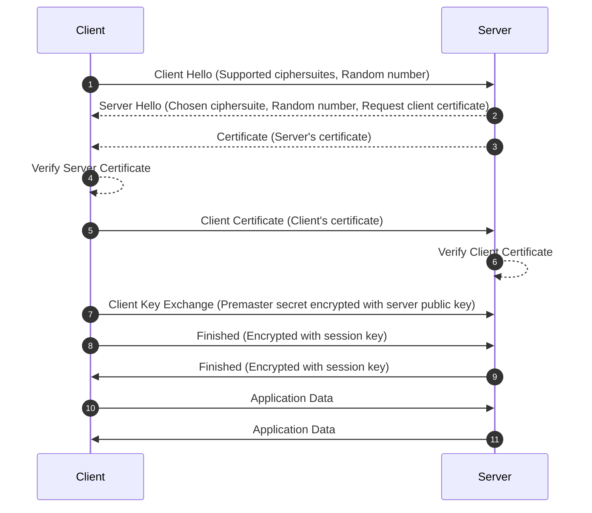
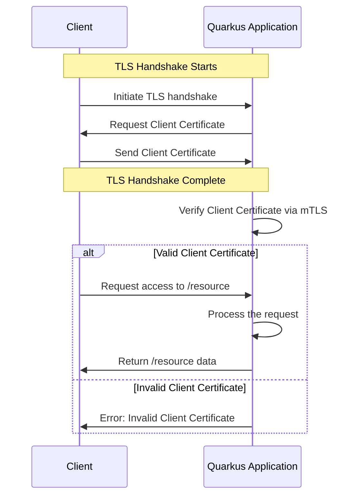
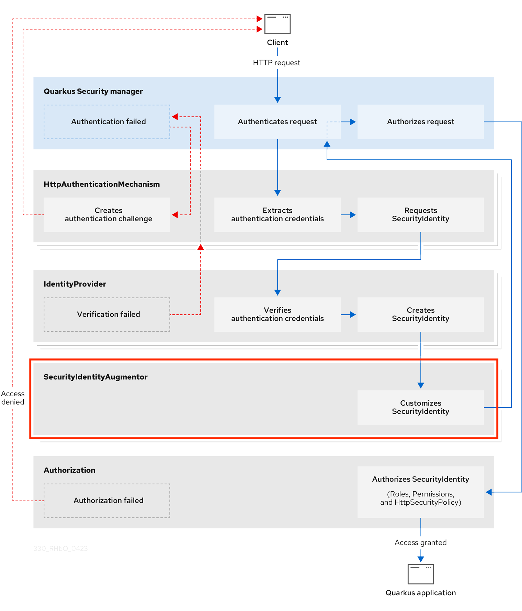
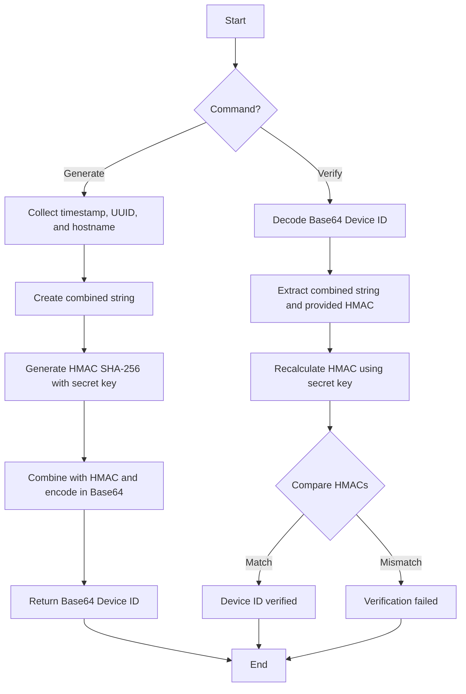
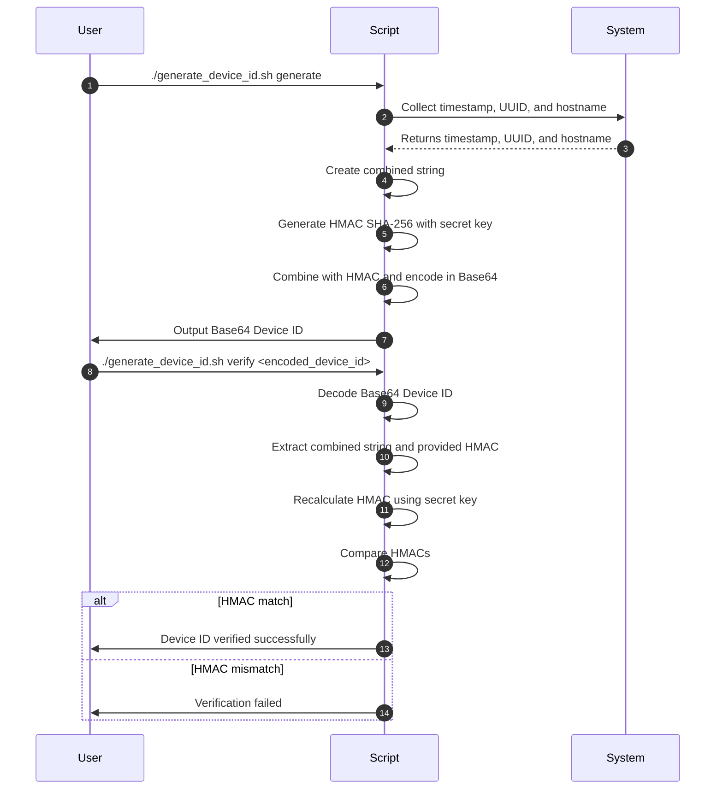
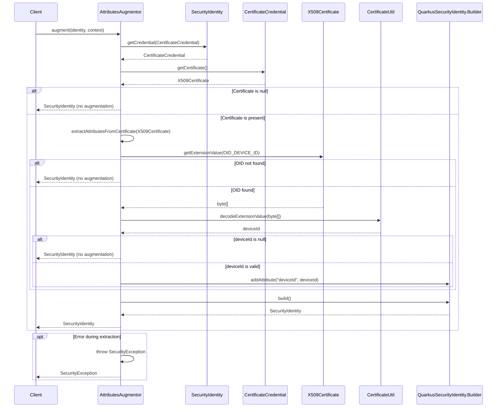
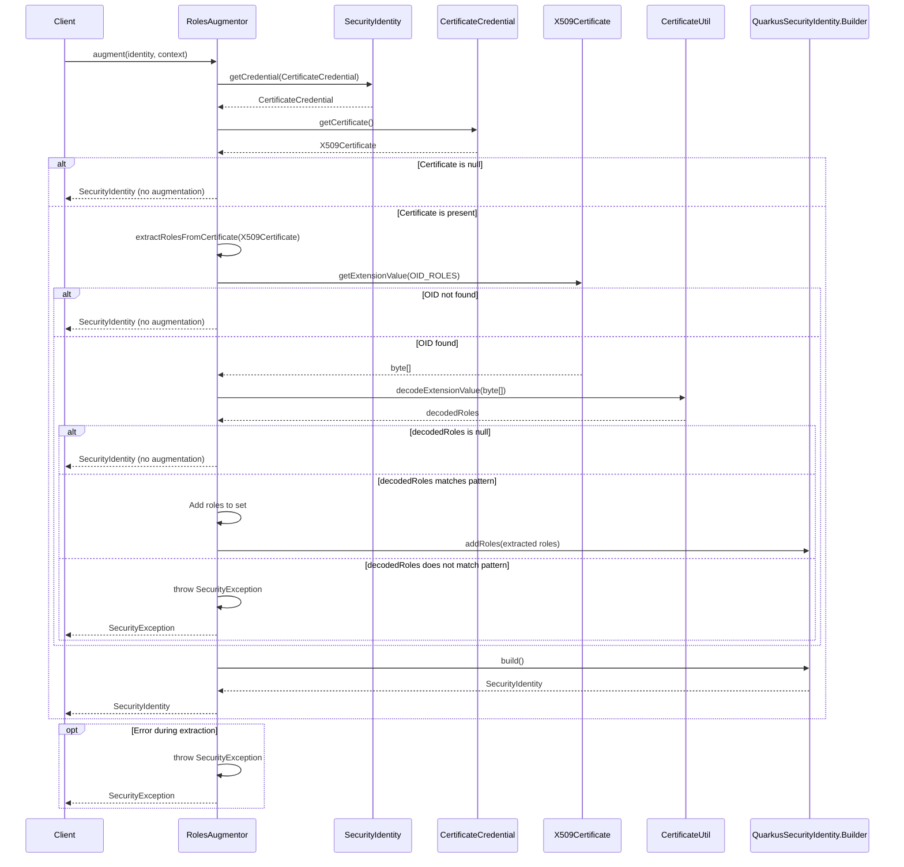
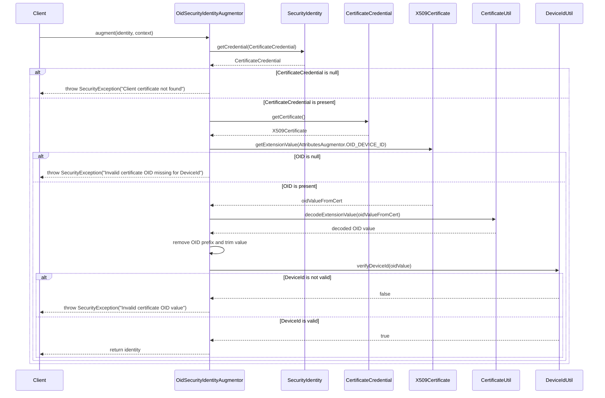
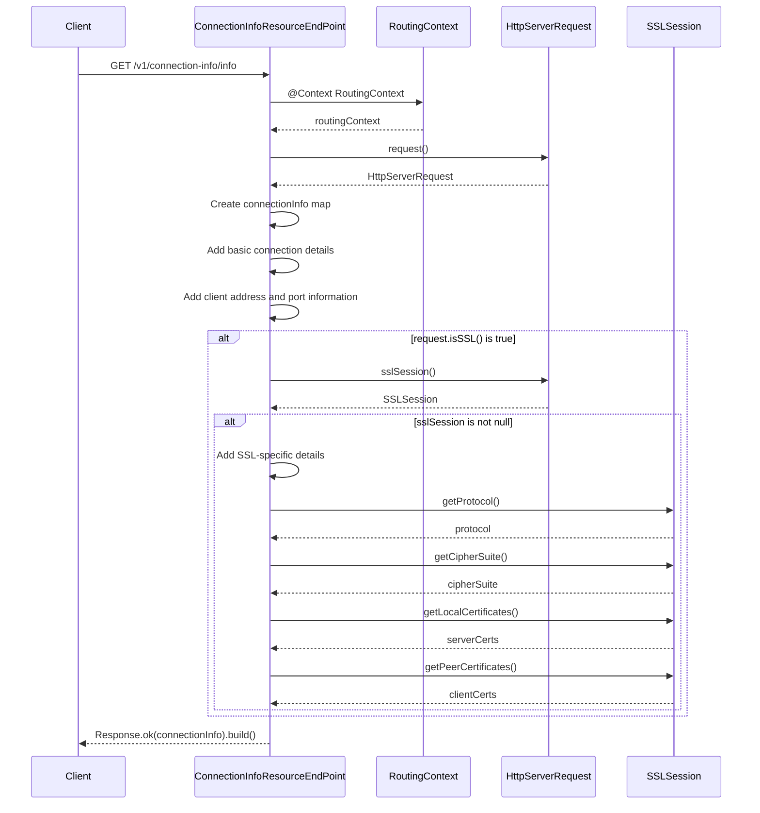
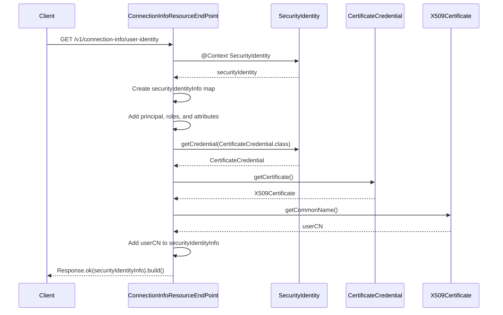

[TOC]


# Implementazione di TLS Mutual Authentication (mTLS) con Quarkus

La sicurezza delle applicazioni web è sempre più critica, soprattutto in contesti in cui le comunicazioni devono essere protette da entrambe le parti coinvolte. In questo contesto, l’**autenticazione reciproca TLS (mTLS)** offre una soluzione solida, garantendo che sia il client che il server siano autenticati prima di stabilire una connessione sicura. In questo articolo vedremo come implementare mTLS in un’applicazione utilizzando **[Quarkus](https://quarkus.io)**, un framework Java ottimizzato per il cloud.


## Cos’è l’autenticazione reciproca TLS (mTLS)?

L’autenticazione reciproca TLS (o mutual TLS) è un’estensione del protocollo TLS standard. Di solito, TLS viene utilizzato per proteggere le comunicazioni tra client e server, dove solo il server deve presentare un certificato valido per autenticarsi con il client. <u>Con mTLS, anche il client deve presentare un certificato valido, garantendo così che entrambe le parti siano autentiche</u>.

Questa autenticazione bidirezionale è particolarmente utile in applicazioni distribuite, microservizi o API, dove sia il client che il server devono fidarsi reciprocamente prima di scambiare dati sensibili.

Il sequence diagram a seguire mostra il processo di autenticazione reciproca TLS (mTLS) tra un client e un server. In particolare, il client invia il proprio certificato al server, che lo verifica prima di stabilire una connessione sicura. Se il certificato del client è valido, il server procede con l’autenticazione e la comunicazione può iniziare (come ultimo step).




Figura 1 - Sequence diagramm del processo di autenticazione reciproca TLS (mTLS)


È importate capire che la verifica dei certificati nel contesto mTLS è un processo cruciale per garantire la sicurezza della connessione, impedendo la comunicazione con entità non fidate o malintenzionate. Se una delle verifiche fallisce (ad esempio, il certificato è scaduto o non valido), l’handshake viene interrotto e la connessione non viene stabilita. 

Vediamo di approfondire quali sono i passaggi chiave per la verifica dei certificati in un contesto mTLS.


### Verifica del certificato del server da parte del client

Quando il server invia il proprio certificato al client, quest’ultimo deve verificarlo attraverso i seguenti passaggi:


- **Catena di certificazione (Certificate Chain)**: Il client controlla che il certificato ricevuto dal server appartenga a una catena di certificati attendibili. Questo significa che il certificato del server deve essere firmato da un’autorità di certificazione (CA) che è inclusa nell’elenco delle CA fidate del client. La catena di certificazione viene verificata partendo dal certificato del server fino alla CA radice fidata.
- **Firma del certificato**: Il client verifica la firma digitale sul certificato del server. La firma deve essere stata generata dalla CA utilizzando la sua chiave privata. Il client usa la chiave pubblica della CA, inclusa nel certificato della CA, per verificare la firma. Se la firma corrisponde, il certificato non è stato modificato e può essere considerato autentico.
- **Validità temporale**: Il client verifica che il certificato non sia scaduto, controllando le date di validità (notBefore e notAfter) contenute nel certificato.
- **Revoca del certificato**: Il client può verificare se il certificato del server è stato revocato. Questo avviene tramite il controllo delle CRL (Certificate Revocation List) o utilizzando il protocollo OCSP (Online Certificate Status Protocol) per interrogare in tempo reale lo stato del certificato.
- **Hostname**: Il client verifica che l’hostname del server corrisponda a quello presente nel certificato (nel campo Subject o nel campo Subject Alternative Name). Questo assicura che il certificato sia effettivamente emesso per il server con cui il client sta tentando di comunicare.


### Verifica del certificato del client da parte del server

Quando il client invia il proprio certificato al server (se richiesto), il server deve verificarlo con i seguenti passaggi simili a quelli effettuati dal client:


- **Catena di certificazione**: Il server verifica che il certificato del client appartenga a una catena di certificati attendibili, cioè che sia firmato da una CA che il server riconosce come fidata. Anche qui si controlla la catena fino alla CA radice.
- **Firma del certificato**: Il server verifica la firma digitale sul certificato del client, utilizzando la chiave pubblica della CA che ha emesso il certificato per assicurarsi che la firma sia valida e che il certificato non sia stato alterato.
- **Validità temporale**: Il server controlla che il certificato del client non sia scaduto, verificando le date di inizio e fine validità.
- **Revoca del certificato**: Come nel caso del client, anche il server può effettuare un controllo per verificare se il certificato del client è stato revocato, usando una CRL o il protocollo OCSP.
- **Identità del client**: In alcuni casi, il server può verificare che il certificato del client corrisponda a un’entità specifica (ad esempio, un’azienda o un dispositivo) che ha diritto di accedere ai servizi del server. Questa verifica può essere basata sui campi presenti nel certificato, come il campo Subject.


### Crittografia e integrità dei certificati

Durante l’handshake, la chiave pubblica contenuta nei certificati viene utilizzata per scambiare in modo sicuro il **premaster secret**, che verrà poi trasformato nella chiave di sessione. Grazie a questo, il client e il server possono essere certi dell’identità reciproca e stabilire una connessione sicura.


### I cassetti digitali

Sì, i certificati utilizzati per l'autenticazione, sia lato client che lato server, sono memorizzati in **repository specifici** che fungono da "cassetti" digitali in cui i certificati vengono conservati e verificati durante l'handshake TLS/mTLS. Ecco una panoramica dei principali luoghi in cui i certificati vengono archiviati e controllati:


#### 1. Truststore
Il **truststore** è una raccolta di certificati radice di autorità di certificazione (CA) fidate. Questo è il "cassetto" dove vengono conservati i certificati delle CA che il sistema considera attendibili.

- **Lato Client**: Quando il client riceve il certificato del server, verifica che il certificato sia stato firmato da una delle CA presenti nel truststore. Se il certificato non può essere tracciato a una CA fidata (cioè, se non c'è una catena valida fino a una CA radice nel truststore), la connessione verrà rifiutata.
  
- **Lato Server**: Analogamente, il server verifica il certificato del client confrontandolo con le CA presenti nel suo truststore.


Qualcuno di starà chiedeno dove si trovi il truststore, questo dipende dal sistema operativo.

- **Sistemi operativi**: Il truststore è integrato nel sistema operativo. Ad esempio, su:
  - **Windows**: i certificati fidati si trovano nel **Certificato Root (CA)** in "Gestione Certificati".
  - **Linux**: il truststore si trova solitamente in directory come `/etc/ssl/certs/` o `/usr/share/ca-certificates/`.
  - **macOS**: il truststore è gestito tramite il **Keychain Access**, che contiene i certificati radice fidati.
  
- **Applicazioni**: Alcune applicazioni, come browser web o server, mantengono il proprio truststore separato. Ad esempio, i browser come Firefox usano un truststore indipendente da quello del sistema operativo.


#### 2. Keystore
Il **keystore** è il luogo in cui vengono archiviati i certificati **privati** e le chiavi private associate a un'entità (come un server o un client). È simile a un portafoglio digitale che contiene le credenziali usate per identificarsi durante l'handshake.

- **Lato Server**: Il server archivia il proprio certificato e la chiave privata nel keystore. Quando il client richiede il certificato del server, questo viene estratto dal keystore e inviato al client per la verifica.
  
- **Lato Client**: Se la verifica del client è obbligatoria (come nel caso dell'mTLS), il client invia il proprio certificato estratto dal keystore quando il server lo richiede. Insieme al certificato, il client utilizza la chiave privata memorizzata nel keystore per firmare i messaggi di autenticazione durante l'handshake.


Qui la posizione del keystore dipende dal tipo di applicazione e dal sistema operativo.

- **Java KeyStore (JKS)**: Java usa un formato keystore specifico chiamato **JKS**. Questo file può contenere certificati e chiavi private ed è ampiamente usato in ambienti Java, come server applicativi (es. Tomcat, Spring Boot).
  
- **PKCS#12 (PFX o P12)**: È un formato standard per contenere certificati e chiavi private. Viene usato su diversi sistemi operativi e server. Ad esempio, i file `.pfx` o `.p12` possono essere caricati in un server come Apache o NGINX.

- **Keychain (macOS)**: Su macOS, i certificati e le chiavi private possono essere memorizzati nel **Keychain**.


#### 3. Verifica tramite CRL o OCSP
Dopo aver estratto i certificati dai rispettivi "cassetti" (truststore o keystore), il client o il server possono verificare la validità del certificato, assicurandosi che non sia stato revocato.

- **CRL (Certificate Revocation List)**: È un elenco pubblicato dalle CA che elenca i certificati revocati. Durante l'handshake, il client o il server possono consultare questa lista per verificare se il certificato è stato revocato.

- **OCSP (Online Certificate Status Protocol)**: Invece di scaricare un'intera lista, il sistema può interrogare un server OCSP per verificare in tempo reale se un certificato è stato revocato.


Volendo fare un riassunto, ecco un elenco dei principali componenti coinvolti nella gestione dei certificati e nella verifica durante l'handshake TLS/mTLS.

- **Truststore**: Contiene i certificati delle CA radice fidate e viene usato per verificare i certificati ricevuti da client o server. 
- **Keystore**: Contiene il certificato dell'entità (client o server) e la relativa chiave privata. Viene usato per l'autenticazione.
- **CRL/OCSP**: Utilizzati per controllare la revoca dei certificati.


In questo modo, i certificati sono archiviati e gestiti nei rispettivi "cassetti" (truststore/keystore), e vengono verificati tramite processi di validazione durante l'handshake TLS/mTLS per garantire la sicurezza e l'integrità della connessione.


## Perché gestire mTLS direttamente sull'applicazione?

Sono sicurissimo che qualcuno di voi potrebbe obiettare quanto segue: solitamente in ambienti di produzione, la sicurezza mTLS viene gestita da apparati ad hoc collocati davanti l’applicazione, quindi, quali sono i vantaggi nel configurare mTLS direttamente sull’applicazione?

È vero che in molti ambienti di produzione la sicurezza mTLS viene spesso gestita da dispositivi dedicati, come load balancer o gateway API, che si trovano davanti all’applicazione. Tuttavia, configurare mTLS direttamente sull’applicazione presenta alcuni vantaggi significativi, specialmente in certi scenari e architetture. Di seguito, esploreremo i motivi per cui questa scelta può essere valida.


### Vantaggi di configurare mTLS direttamente sull’applicazione

A seguire vedremo brevemente quali siano i vantaggi principali nell'adozione di questa scelta.


#### 1. Maggiore controllo e flessibilità

Configurare mTLS direttamente sull’applicazione consente di avere un controllo più granulare su come e quando l’autenticazione reciproca viene applicata. Ad esempio, puoi decidere:


- Quali endpoint richiedono mTLS e quali no.

- Diversificare la gestione dei certificati a livello di servizio o microservizio in base alle esigenze di sicurezza specifiche.


Questo tipo di configurazione può essere particolarmente utile in ambienti **multi-tenant** o con **servizi sensibili**, dove i requisiti di sicurezza possono variare da un microservizio all’altro.


#### 2. Difesa in profondità

In sicurezza informatica, il principio di **difesa in profondità** (vedi sezione [Importanti principi di protezione dell’ISA/IEC 62443](https://www.cybersecurity360.it/outlook/i-nuovi-standard-degli-iacs-che-cosa-sono-e-a-cosa-servono/)) implica la stratificazione di più livelli di protezione. Anche se mTLS viene implementato a livello di gateway o di load balancer, aggiungere un ulteriore strato di sicurezza direttamente nell’applicazione riduce il rischio di compromissioni:


- Se l’infrastruttura del gateway viene bypassata o compromessa, l’applicazione richiede comunque l’autenticazione reciproca per accedere.


In questo modo, anche se un attaccante riuscisse a superare un dispositivo di sicurezza a monte, troverebbe comunque un altro livello di protezione all’interno dell’applicazione.


#### 3. Sicurezza end-to-end

Gestendo mTLS a livello dell’applicazione, puoi garantire una **sicurezza end-to-end** tra i client e i microservizi, senza dover delegare la fiducia a dispositivi intermedi. In ambienti distribuiti, soprattutto in scenari di microservizi, questo garantisce che le connessioni siano protette **fino all’applicazione stessa**, non solo fino al gateway.


- I **certificati del client** sono validati direttamente dall’applicazione, eliminando potenziali punti di vulnerabilità legati a configurazioni errate o attacchi intermedi che potrebbero verificarsi tra il gateway e l’applicazione.


#### 4. Riduzione della complessità di infrastruttura

In alcune architetture moderne, come quelle **serverless** o **microservizi in ambienti containerizzati**, l’uso di dispositivi dedicati per la gestione della sicurezza può introdurre complessità e aumentare la latenza nelle comunicazioni. Implementare mTLS direttamente sui microservizi può ridurre la dipendenza da questi dispositivi e semplificare l’architettura complessiva:


- In ambienti dinamici, dove i microservizi si scalano rapidamente, l’uso di **service mesh** (ad esempio [Istio](https://istio.io/)) o configurazioni centralizzate a livello di applicazione può risultare più gestibile rispetto a delegare tutto ai dispositivi di front-end.


#### 5. Ambienti multi-cloud o ibridi

In contesti **multi-cloud** o **ibridi**, in cui i servizi sono distribuiti su diversi provider o persino on-premise, configurare mTLS direttamente sulle applicazioni garantisce che la sicurezza sia gestita in modo uniforme, indipendentemente da dove vengono eseguite. In questi casi, affidarsi completamente a dispositivi di front-end potrebbe non essere pratico o potrebbe richiedere una complessità aggiuntiva in termini di gestione dei certificati tra provider diversi.


#### 6. Indipendenza dai dispositivi di rete

Affidarsi completamente ai dispositivi dedicati per la gestione di mTLS può comportare un legame tecnologico con una particolare infrastruttura o provider. Gestire la sicurezza mTLS direttamente sull’applicazione riduce la dipendenza da questi dispositivi, offrendo **portabilità** tra ambienti diversi (ad esempio, passare da un cloud provider all’altro senza dover riconfigurare l’infrastruttura di sicurezza a monte).


#### 7. Testing e sviluppo più sicuri

Configurare mTLS direttamente nell’applicazione permette di simulare e testare scenari di sicurezza anche in ambienti di **sviluppo** o **pre-produzione**, senza dover riprodurre l’intera infrastruttura di produzione. In questo modo, i team di sviluppo possono:


- Testare con maggiore precisione le configurazioni di sicurezza che verranno utilizzate in produzione.
- Implementare flussi di **DevSecOps** più fluidi, dove la sicurezza viene verificata in ogni fase del ciclo di vita del software.


#### 8. Personalizzazione della logica di autenticazione

In alcuni casi, potrebbe essere necessario **personalizzare la logica di autenticazione** in base alle esigenze specifiche dell’applicazione. Configurare mTLS direttamente nel codice o nelle configurazioni dell’applicazione permette di introdurre logiche personalizzate come:


- Validazioni aggiuntive sui certificati.
- Limitare l’accesso a specifici client in base a metadati contenuti nei certificati.


### Quando usare dispositivi dedicati per la gestione di mTLS?

Nonostante i vantaggi della configurazione di mTLS direttamente nell’applicazione, ci sono contesti in cui l’uso di dispositivi dedicati rimane una scelta preferibile:


- **Scalabilità centralizzata**: In ambienti con molti servizi e microservizi, potrebbe essere più semplice e scalabile gestire mTLS a livello di gateway, piuttosto che applicare la stessa configurazione a decine o centinaia di microservizi.
- **Performance e ottimizzazione**: Gli apparati specializzati (come load balancer hardware) possono essere ottimizzati per gestire rapidamente grandi quantità di connessioni TLS e mTLS, riducendo la latenza e scaricando l’onere crittografico dalle applicazioni.
- **Amministrazione centralizzata**: In organizzazioni di grandi dimensioni con team separati, delegare la gestione di mTLS a dispositivi dedicati può ridurre la complessità di gestione da parte degli sviluppatori, permettendo ai team di rete e sicurezza di concentrarsi esclusivamente su questi aspetti.


### In conclusione...

Configurare **mTLS direttamente sull’applicazione** in Quarkus offre una serie di vantaggi, tra cui maggiore controllo, flessibilità e sicurezza end-to-end. Questo approccio può essere particolarmente utile in ambienti distribuiti, multi-cloud, o in scenari dove la **difesa in profondità** è un requisito fondamentale.


Sebbene ci siano contesti in cui dispositivi dedicati a monte siano la scelta migliore per la gestione della sicurezza, integrare mTLS a livello di applicazione permette una gestione più granulare e può migliorare la sicurezza in architetture moderne come microservizi e container.


## Quale scenario andremo a implementare

Utilizzando Quarkus andremo a implementare un classico scenario dove una risorsa (in questo caso REST) sia protetta attraverso il meccanismo mTLS. Il sequence diagram mostrato a seguire illustra proprio lo scenario, dove:


1. il **Client** inizia la connessione TLS con l’applicazione **Quarkus**;
2. **Quarkus** richiede il certificato del client come parte della procedura di autenticazione reciproca mTLS;
3. il **Client** invia il proprio certificato;
4. **Quarkus** verifica il certificato del client
   1. se il certificato è valido, **Quarkus** elabora la richiesta di accesso alla risorsa e restituisce i dati della risorsa;
   2. se il certificato non è valido, **Quarkus** restituisce un errore, negando l’accesso alla risorsa.


Sul sequence diagram, sono stati omessi volutamente alcune delle fasi del processo TLS Handshake per dare risalato a quelle fasi che contribuisco al meccanismo di mutua autenticazione. Per il processo completo, fare riferimento al capitolo *Cos’è l’autenticazione reciproca TLS (mTLS)*.




Figura 2 - Sequence diagramm della soluzione di mTLS da implementare tramite Quarkus


Per realizzare la soluzione mostrata nel diagramma precedente, avremo bisogno dei seguenti strumenti software.


- Java 21
- Maven (per la gestione del progetto)
- Quarks CLI (per l'installazione fare riferimento [Building Quarkus apps with Quarkus Command Line Interface (CLI)](https://quarkus.io/guides/cli-tooling))
- Certificati TLS per il client e il server
- OpenSSL per gestire la generazione dei certificati


Nel corso dell'implementazione andremo a utilizzare diversi componenti di Quarkus che rientrano nel parona dell'**architettura di sicurezza** di Quarkus e per cui invito a leggere le seguenti risorse:


1. [Quarkus Security architecture](https://quarkus.io/guides/security-architecture)
2. [Quarkus Security overview](https://quarkus.io/guides/security-overview)
3. [Built-in authentication mechanisms](https://quarkus.io/guides/security-authentication-mechanisms#built-in-authentication-mechanisms)
4. [Authorization of web endpoints](https://quarkus.io/guides/security-authorize-web-endpoints-reference)
5. [TLS registry reference](https://quarkus.io/guides/tls-registry-reference)


La figura 3 mostra l'architettura di sicurezza di Quarkus, dove ho volutamente evendenziare lo strato che riguarda il componente **[SecurityIdentityAugmentor](https://quarkus.io/guides/security-architecture#securityidentityaugmentor)** perché nel corso dell'articolo vedremo a cosa serve questo componente e come implementare una personalizzazione utile per i nostri scopi.




Figura 3 - Quarkus Security Architecture e flow del processo di autenticazione e autorizzazione (fonte Quarkus.io)


Tra l'elenco delle risorse ho menzionato il **TLS Registry** che utilizzermo per potare a termine con successo l'implementazione della soluzione. 

**Cos’è il TLS Registry di Quarkus?** È un'estensione di Quarkus che centralizza la configurazione TLS per l'applicazione. Consente di definire la configurazione TLS in un unico luogo e di farvi riferimento da più punti nell'applicazione. Nel corso dell'articolo vedremo come ci verrà incontro.


## Requisiti dell'applicazione Quarkus

Siamo certi del fatto che dobbiamo implementare la nostra applicazione per il supporto mTLS. In particolare andremo a implementare quanto descritto in maniera sintetica dalla tabella a seguire.


| ID      | Requisito                                           | Descrizione                                                  |
| ------- | --------------------------------------------------- | ------------------------------------------------------------ |
| 1       | Autenticazione mTLS                                 | È richiesto che l'applicazione supporti mTLS come meccanismo di autenticazione utilizzando certificati in formato PEM e PKCS#12. |
| 2       | Private end-point REST                              | È richiesto la realizzazione di due end-point REST il cui accesso deve essere garantito solo ai client che si presentano con un certificato client avente determinate carratteristiche (vedi capitolo *Generazione dei certificati*).<br /><br />Il primo end-point deve essere definito con la URI `/v1/connection-info/info` con metodo `GET` e produrre un JSON avente la struttura mostrata al capitolo *Struttura JSON di risposta dei servizi REST*. La risposta del servizio conterrà un set d'informazioni che riguardano la connessione instaurata.<br /><br />Il secondo end-point deve essere definito con la URI  `/v1/connection-info/user-identiy` con metodo `POST` e produrre un JSON avente la struttura mostrata al capitolo *Struttura JSON di risposta dei servizi REST*. La risposta del servizio conterrà un set d'informazioni che riguardano l'indentità del client che ha richiesto l'accesso alla risorsa. |
| 3       | Mapping automatico dei ruoli                        | È richiesto che l'applicazione sia capace di mappare attributi specifici del certificato client sui **ruoli** gestisti da Quarkus (vedi [Authorization of web endpoints](https://quarkus.io/guides/security-authorize-web-endpoints-reference)). Per i dettagli sulla struttura del certificato client fare riferimento al capitolo *Generazione dei certificati*. |
| 4       | Mapping automatico degli attributi d'identità       | È richiesto che l'applicazione sia capace di mappare attributi specifici del certificato client sugli **Identity Attributes** del client che ha richiesto l'accesso alla risorsa. Per i dettagli sulla struttura del certificato client fare riferimento al capitolo *Generazione dei certificati*. |
| 5       | Definizione delle policy di accesso ai servizi Rest | È richiesto che l'applicazione definisca una policy chiamata per esempio `role-policy-cert` che definisca i ruoli *User* e *Administrator* come abilitati per l'accesso alle due risorse REST descritte sul requisito numero 1. |
| 6_BONUS | Accesso tramite CIE (Carta Identità Elettronica)    | È richiesto che l'applicazione sia capace di fare accedere agli end-point descritti dal requisito numero 2, i client che si presentino con un certificato CIE valido estendendo al gestione delle policy e ruoli. |

Tabella 1 - Requisiti che l'applicazione Quarkus deve implementare.


### Generazione dei certificati

Per gestire correttamente la mutua autenticazione allo scopo di fare anche dei test sul nostro ambiente di sviluppo, abbiamo la necessità di disporre dei seguenti certificati [X.509](https://en.wikipedia.org/wiki/X.509#Certificates):

1. un certificato di [Certificate Authority (CA)](https://it.wikipedia.org/wiki/Certificate_authority);
2. un certificato server per il servizio HTTPS, quest'ultimo basato su [Vert.x Core](https://vertx.io/docs/vertx-core/java/) integrato all'interno di Quarkus;
3. un set di [certificati client](https://en.wikipedia.org/wiki/Client_certificate) che abbiamo le caretteristiche necessarie per accedere ai servizi (vedi requisiti tre, quattro e sei)


Per il nostro ambiete di sviluppo, siamo autonomi nella generazione dei certificati ma al momento vediamo quali sono le caratteriste dei certificati che dovremo generare e che sono mostrate nella tabella a seguire.


| Tipo   | CN                                                          | SAN                                                          | O             | OU                | L         | ST      | C        | Valitità  | Issuer                |
| ------ | ----------------------------------------------------------- | ------------------------------------------------------------ | ------------- | ----------------- | --------- | ------- | -------- | --------- | --------------------- |
| CA     | Dontesta CA                                                 |                                                              | Dontesta      | IT Labs           | Bronte    | Catania | IT       | 5 anni    | self                  |
| Server | rd.quarkus.dontesta.it                                      | admin.quarkus.dontesta.it, blog.quarkus.dontesta.it, localhost | Dontesta      | IT Labs           | Bronte    | Catania | IT       | 1 anno    | Dontesta CA, Dontesta |
| Client | #client-id (può essere un qualunque tipo di identificatore) |                                                              | #Organization | #OrganizationUnit | #Locality | #State  | #Country | #Validity | #Issure               |

Tabella 2 - Caratteristiche dei certificati da generare


Per soddisfare il requisto tre e quattro, il certificato client deve essere creato con le seguenti caratteristiche:


1. **clientAuth in extendedKeyUsage**: l’extendedKeyUsage con il valore **clientAuth** indica che il certificato può essere utilizzato per l’autenticazione del client, in particolare in contesti mTLS o altre situazioni in cui un client deve dimostrare la propria identità a un server. L’**Object Identifier (OID)** associato a clientAuth è 1.3.6.1.5.5.7.3.2, ed è riconosciuto universalmente per identificare certificati che possono essere utilizzati per l’autenticazione dei client;

2. **estensione personalizzate**: per gestire i ruoli e attributi, i certificati client dovranno avere le seguenti estensioni personalizzate:

   1. 1.3.6.1.4.1.99999.1 = ASN1:UTF8String:Role=${ext_cert_role}
   2. 1.3.6.1.4.1.99999.2 = ASN1:UTF8String:DeviceId=${ext_cert_device_id}

    

Le due estensioni personalizzate che sono identificate con OID della classe privata `1.3.6.1.4.1` dove `99999` rappresenta un numero riservato per un’ipotetica organizzazione, sono usate rispettivamente per indicare ruoli e il deviceId. I placeholder `${ext_cert_role}` e `${ext_cert_device_id}` conterranno i rispettivi valori per Role e DeviceId.

L'estensione personalizzata avente OID  `1.3.6.1.4.1.99999.1`  deve contenere uno più ruoli attraverso una stringa che dovrà rispettare il pattern `^Role=([A-Za-z]+(?:,[A-Za-z]+)*+)$`.

L'estesione personalizzata avente OID `1.3.6.1.4.1.99999.2` deve contenere l'identificativo di un ipotetico deviceId il cui valore deve essere calcolato secondo un regola ben definita e che vedremo successivamente.

In termini di configurazione OpenSSL, a seguire è mostrato un esempio di configurazione da usare per la generazione dei certificati client usando OpenSSL.


```ini
[ client_cert ]
basicConstraints = CA:FALSE
keyUsage = digitalSignature, keyEncipherment
extendedKeyUsage = critical, clientAuth
subjectKeyIdentifier = hash
authorityKeyIdentifier = keyid,issuer

# Estensioni personalizzate
1.3.6.1.4.1.99999.1 = ASN1:UTF8String:Role=${ext_cert_role}
1.3.6.1.4.1.99999.2 = ASN1:UTF8String:DeviceId=${ext_cert_device_id}
```

Configurazione 1 - Configurazione di OpenSSL per la generazione dei certificati client


L'extendedKeyUsage clientAuth ha il flag a **critical** perché la sua interpretazione da parte del server TLS è fondamentale; le estensioni personalizzate non sono segnate come critical, per cui il server TLS le ignorerà ma non i componenti di mapping (vedi requisiti tre e quattro). 

A seguire è mostrato un estratto della chiave pubblica di un certificato client generato secondo le specifiche discusse in precendenza. La sezione **X509v3 extensions** mostra appunto le estensioni usate, sia quelle standard, sia quelle personalizzate.


```tex
Certificate:
    Data:
        Version: 3 (0x2)
        Serial Number:
            65:ef:ed:e0:55:06:f7:fa:23:75:ea:a5:df:c6:61:ab:75:8c:38:21
        Signature Algorithm: sha256WithRSAEncryption
        Issuer: C=IT, ST=Catania, L=Bronte, O=Dontesta, OU=IT Labs, CN=Dontesta CA
        Validity
            Not Before: Sep 12 09:47:43 2024 GMT
            Not After : Sep 12 09:47:43 2025 GMT
        Subject: C=IT, ST=Italy, L=Rome, O=Bad Corporation, OU=Community & News, CN=24A5CCC7-EE36-4449-9025-54CED3011920
        Subject Public Key Info:
            Public Key Algorithm: rsaEncryption
                Public-Key: (2048 bit)
                Modulus: ...
                Exponent: 65537 (0x10001)
        X509v3 extensions:
            X509v3 Basic Constraints:
                CA:FALSE
            X509v3 Key Usage:
                Digital Signature, Key Encipherment
            X509v3 Extended Key Usage: critical
                TLS Web Client Authentication
            X509v3 Subject Key Identifier:
                AF:06:90:23:56:1B:97:6A:E4:B3:63:4E:E3:F0:8A:24:6E:FE:A3:CD
            X509v3 Authority Key Identifier:
                28:CB:D3:55:FE:FA:AA:6D:34:D4:45:56:9D:A8:68:F1:E4:6D:20:A3
            1.3.6.1.4.1.99999.1:
                ..Role=User,CommunityManager
            1.3.6.1.4.1.99999.2:      ...DeviceId=MTcyNjEzNDQ2MzExMzA3NjAwMCM0MWJmNDAxNC1lNDFlLTQ5YWUtYTU4Mi02NTJiMGEzMzVlMTcjYW11c2FycmEtbWFjYm9vay1wcm8ubG9jYWwjYTdkMmZmNDI0NjJiMGZjYWRhMzM1YjAwN2NhN2E4YTY5NzVkNjZlNmE3MDg3N2M1MzczM2VmYmYzODBkMWQ5Nw==
    Signature Algorithm: sha256WithRSAEncryption
    Signature Value:...
```

Configurazione 2 - Estratto della chiave pubblica di un certificato client generato secondo le specifiche.


#### Algoritmo per la generazione del DeviceId

La generazione del DeviceId dovrà avvenire nel modo seguente:

1. combina il timestamp corrente, un [UUID (Universally Unique Identifier)](https://it.wikipedia.org/wiki/Universally_unique_identifier) generato e l’hostname del dispositivo per creare una stringa unica. Le singole informazioni devono essere seperate dal carattere # (hash o diesis);
2. genera un [HMAC (Hash-based Message Authentication Code)](https://it.wikipedia.org/wiki/HMAC) usando SHA-256 e una chiave segreta;
3. combina queste informazioni e codifica il risultato in Base64.


Il processo di verifica, è praticamente l'inverso:

1. decodifica un DeviceId codificato in Base64;
2. separa la stringa combinata e l’HMAC fornito;
3. rigenera l’HMAC basandosi sulla stringa originale.
4. confronta l’HMAC calcolato con quello fornito per verificare la validità dell’ID.


A seguire è mostrato il flow di quanto descritto in precedenza per generare e verificare il DeviceId.




Figura 4 - Flow per la generazione e verifica del DeviceId.


A seguire è mostrato lo pseudo codice per la generazione del DeviceId. Se fate attenzione, il DeviceId mostrato nell'esempio è quello visibile sulle info del certificato client di esempio mostrato in configurazione 2.


```bash
# Combined string
# Generate a unique string based on timestamp, UUID, and hostname
# timestamp=$(date +%s%N)                      # Get the current timestamp with nanoseconds
# uuid=$(uuidgen | tr '[:upper:]' '[:lower:]') # Generate a UUID and convert it to lowercase
# hostname=$(hostname)                         # Use the device's hostname for additional uniqueness
# combined_string="${timestamp}#${uuid}#${hostname}"
1726134463113076000#41bf4014-e41e-49ae-a582-652b0a335e17#amusarra-macbook-pro.local

# HMAC sha256 with secret key my_secret_key_for_generate_device_id
# Generate an HMAC SHA-256 based on the combined string and the secret key
# hmac=$(echo -n "$combined_string" | openssl dgst -sha256 -hmac "$DEVICE_ID_SECRET_KEY" | awk '{print $2}')
a7d2ff42462b0fcada335b007ca7a8a6975d66e6a70877c53733efbf380d1d97

# Combine the device ID with the HMAC
# device_id="${combined_string}#${hmac}"
1726134463113076000#41bf4014-e41e-49ae-a582-652b0a335e17#amusarra-macbook-pro.local#a7d2ff42462b0fcada335b007ca7a8a6975d66e6a70877c53733efbf380d1d97

# DeviceId in Base64
# Encode the result using Base64
# encoded_device_id=$(echo -n "$device_id" | base64)
MTcyNjEzNDQ2MzExMzA3NjAwMCM0MWJmNDAxNC1lNDFlLTQ5YWUtYTU4Mi02NTJiMGEzMzVlMTcjYW11c2FycmEtbWFjYm9vay1wcm8ubG9jYWwjYTdkMmZmNDI0NjJiMGZjYWRhMzM1YjAwN2NhN2E4YTY5NzVkNjZlNmE3MDg3N2M1MzczM2VmYmYzODBkMWQ5Nw==
```

 Source Code 1 - Pseudo codice che mostra la generazione del DeviceId


Volendo implementare uno script per la generazione e verifica del DeviceId, quello a seguire è il sequence diagram.




Figura 5 - Sequence Diagram che mostra il funzionamento di un ipotetico script di generazione e verifica del DeviceId.


### Struttura JSON di risposta dei servizi Rest

A seguire lo schema del JSON di risposta per il servizio `/api/v1/connection-info/user-identity` e un esempio dell'istanza.

```json
{
  "type": "object",
  "properties": {
    "principal": {
      "type": "string",
      "description": "A distinguished name (DN) representing the principal."
    },
    "roles": {
      "type": "array",
      "items": {
        "type": "string"
      },
      "description": "An array of roles assigned to the principal."
    },
    "attributes": {
      "type": "object",
      "properties": {
        "deviceId": {
          "type": "string",
          "description": "An identifier for the device associated with the principal."
        }
      },
      "required": ["deviceId"],
      "description": "Additional attributes related to the principal."
    },
    "userCN": {
      "type": "string",
      "description": "The common name (CN) of the user."
    }
  },
  "required": ["principal", "roles", "attributes", "userCN"],
  "description": "Schema for representing a user principal with roles and attributes."
}
```

Source Code 2 - Schema del JSON di risposta per il servizio `/api/v1/connection-info/user-identity` 


```json
{
  "principal": "CN=24A5CCC7-EE36-4449-9025-54CED3011920,OU=Community & News,O=Bad Corporation,L=Rome,ST=Italy,C=IT",
  "roles": [
    "User",
    "CommunityManager"
  ],
  "attributes": {
    "deviceId": "MTcyNjEzNDQ2MzExMzA3NjAwMCM0MWJmNDAxNC1lNDFlLTQ5YWUtYTU4Mi02NTJiMGEzMzVlMTcjYW11c2FycmEtbWFjYm9vay1wcm8ubG9jYWwjYTdkMmZmNDI0NjJiMGZjYWRhMzM1YjAwN2NhN2E4YTY5NzVkNjZlNmE3MDg3N2M1MzczM2VmYmYzODBkMWQ5Nw=="
  },
  "userCN": "24A5CCC7-EE36-4449-9025-54CED3011920"
}
```

Source Code 3 - Esempio di risposta JSON del servizio `/api/v1/connection-info/user-identity` 


A seguire lo schema del JSON di risposta per il servizio `/api/v1/connection-info/info` e un esempio dell'istanza.

```json
{
  "type": "object",
  "properties": {
    "httpRequestHeaders": {
      "type": "object",
      "properties": {
        "user-agent": {
          "type": "string",
          "description": "User agent string of the HTTP request."
        },
        "accept": {
          "type": "string",
          "description": "Accept header of the HTTP request."
        }
      },
      "required": ["user-agent", "accept"],
      "description": "Headers of the HTTP request."
    },
    "server": {
      "type": "object",
      "properties": {
        "notAfter": {
          "type": "string",
          "description": "Expiration date of the server's certificate."
        },
        "keyAlgorithm": {
          "type": "string",
          "description": "Algorithm used for the server's key."
        },
        "keySize": {
          "type": "integer",
          "description": "Size of the server's key in bits."
        },
        "certCommonName": {
          "type": "string",
          "description": "Common name of the server's certificate."
        },
        "certIssuer": {
          "type": "string",
          "description": "Issuer of the server's certificate."
        },
        "subjectAlternativeNames": {
          "type": "array",
          "items": {
            "type": "array",
            "items": [
              { "type": "integer" },
              { "type": "string" }
            ]
          },
          "description": "Subject alternative names in the server's certificate."
        },
        "certSubject": {
          "type": "string",
          "description": "Subject of the server's certificate."
        },
        "certSerialNumber": {
          "type": "string",
          "description": "Serial number of the server's certificate."
        },
        "certPEM": {
          "type": "string",
          "description": "PEM encoded server certificate."
        },
        "customExtensions": {
          "type": "object",
          "description": "Custom extensions for the server's certificate."
        },
        "notBefore": {
          "type": "string",
          "description": "Start date of validity for the server's certificate."
        }
      },
      "required": [
        "notAfter",
        "keyAlgorithm",
        "keySize",
        "certCommonName",
        "certIssuer",
        "subjectAlternativeNames",
        "certSubject",
        "certSerialNumber",
        "certPEM",
        "notBefore"
      ],
      "description": "Details about the server's certificate and key."
    },
    "protocol": {
      "type": "string",
      "description": "Protocol used for the connection (e.g., TLS version)."
    },
    "httpProtocol": {
      "type": "string",
      "description": "HTTP protocol version (e.g., HTTP/2)."
    },
    "clientPort": {
      "type": "integer",
      "description": "Port number used by the client."
    },
    "isSecure": {
      "type": "boolean",
      "description": "Indicates if the connection is secure."
    },
    "client": {
      "type": "object",
      "properties": {
        "notAfter": {
          "type": "string",
          "description": "Expiration date of the client's certificate."
        },
        "keyAlgorithm": {
          "type": "string",
          "description": "Algorithm used for the client's key."
        },
        "keySize": {
          "type": "integer",
          "description": "Size of the client's key in bits."
        },
        "certCommonName": {
          "type": "string",
          "description": "Common name of the client's certificate."
        },
        "certIssuer": {
          "type": "string",
          "description": "Issuer of the client's certificate."
        },
        "subjectAlternativeNames": {
          "type": "null",
          "description": "Subject alternative names in the client's certificate, if any."
        },
        "certSubject": {
          "type": "string",
          "description": "Subject of the client's certificate."
        },
        "certSerialNumber": {
          "type": "string",
          "description": "Serial number of the client's certificate."
        },
        "certPEM": {
          "type": "string",
          "description": "PEM encoded client certificate."
        },
        "customExtensions": {
          "type": "object",
          "properties": {
            "role": {
              "type": "string",
              "description": "Custom role information in the client's certificate."
            },
            "deviceId": {
              "type": "string",
              "description": "Custom device ID information in the client's certificate."
            }
          },
          "description": "Custom extensions for the client's certificate."
        },
        "notBefore": {
          "type": "string",
          "description": "Start date of validity for the client's certificate."
        }
      },
      "required": [
        "notAfter",
        "keyAlgorithm",
        "keySize",
        "certCommonName",
        "certIssuer",
        "certSubject",
        "certSerialNumber",
        "certPEM",
        "notBefore"
      ],
      "description": "Details about the client's certificate and key."
    },
    "userAgent": {
      "type": "string",
      "description": "User agent string used by the client."
    },
    "cipherSuite": {
      "type": "string",
      "description": "Cipher suite used for the connection."
    },
    "clientAddress": {
      "type": "string",
      "description": "Address and port of the client."
    }
  },
  "required": [
    "httpRequestHeaders",
    "server",
    "protocol",
    "httpProtocol",
    "clientPort",
    "isSecure",
    "client",
    "userAgent",
    "cipherSuite",
    "clientAddress"
  ],
  "description": "Schema representing a network connection including server and client details, protocols, and certificates."
}
```

Source Code 4 - Schema del JSON di risposta per il servizio `/api/v1/connection-info/info` 


```json
{
  "httpRequestHeaders": {
    "user-agent": "curl/8.7.1",
    "accept": "*/*"
  },
  "server": {
    "notAfter": "Sun Sep 07 00:16:21 CEST 2025",
    "keyAlgorithm": "RSA",
    "keySize": 2048,
    "certCommonName": "rd.quarkus.dontesta.it",
    "certIssuer": "CN=Dontesta CA,OU=IT Labs,O=Dontesta,L=Bronte,ST=Catania,C=IT",
    "subjectAlternativeNames": [
      [
        2,
        "admin.quarkus.dontesta.it"
      ],
      [
        2,
        "blog.quarkus.dontesta.it"
      ],
      [
        2,
        "localhost"
      ]
    ],
    "certSubject": "CN=rd.quarkus.dontesta.it,OU=IT Labs,O=Dontesta,L=Bronte,ST=Catania,C=IT",
    "certSerialNumber": "581958667903693191343101950434363490497173665817",
    "certPEM": "<certPEM>",
    "customExtensions": {},
    "notBefore": "Sat Sep 07 00:16:21 CEST 2024"
  },
  "protocol": "TLSv1.3",
  "httpProtocol": "HTTP_2",
  "clientPort": 54845,
  "isSecure": true,
  "client": {
    "notAfter": "Fri Sep 12 11:47:43 CEST 2025",
    "keyAlgorithm": "RSA",
    "keySize": 2048,
    "certCommonName": "24A5CCC7-EE36-4449-9025-54CED3011920",
    "certIssuer": "CN=Dontesta CA,OU=IT Labs,O=Dontesta,L=Bronte,ST=Catania,C=IT",
    "subjectAlternativeNames": null,
    "certSubject": "CN=24A5CCC7-EE36-4449-9025-54CED3011920,OU=Community & News,O=Bad Corporation,L=Rome,ST=Italy,C=IT",
    "certSerialNumber": "581958667903693191343101950434363490497173665825",
    "certPEM": "<certPEM>",
    "customExtensions": {
      "role": "Role=User,CommunityManager",
      "deviceId": "DeviceId=MTcyNjEzNDQ2MzExMzA3NjAwMCM0MWJmNDAxNC1lNDFlLTQ5YWUtYTU4Mi02NTJiMGEzMzVlMTcjYW11c2FycmEtbWFjYm9vay1wcm8ubG9jYWwjYTdkMmZmNDI0NjJiMGZjYWRhMzM1YjAwN2NhN2E4YTY5NzVkNjZlNmE3MDg3N2M1MzczM2VmYmYzODBkMWQ5Nw=="
    },
    "notBefore": "Thu Sep 12 11:47:43 CEST 2024"
  },
  "userAgent": "curl/8.7.1",
  "cipherSuite": "TLS_AES_256_GCM_SHA384",
  "clientAddress": "127.0.0.1:54845"
}
```

Source Code 5 - Esempio di risposta JSON del servizio `/api/v1/connection-info/info` 


## Requisiti software

Per sviluppare la nostra soluzione mTLS, abbiamo necessità di una set di strumenti software che potremmo dividere in due categorie.


1.  **Sviluppo**
   1. Java 21
   2. Maven 3.9.x
   3. Quarkus 3.14.x
   4. Quarkus CLI (opzionale ma consigliato)
   5. Git (opzionale)
2. **Gestione certificati TLS** (opzionali ma consigliato)
   1. bash 5.2.x | zsh 5.x | GitBash 2.46
   2. OpenSSL 3.x
   3. Curl 8.x
   4. Java KeyTool (in genere installato con la JDK)
   5. [Xidel](https://github.com/benibela/xidel) è uno strumento da riga di comando e una libreria che consente di estrarre dati da documenti XML, HTML e JSON usando XPath, XQuery o CSS Selectors


La versione del framework di Quarkus deve essere dalla 3.14 in poi, questo perché alcune delle funzionalità, come per esempio il TSL Registry è stato introdotto dalla versione 3.14.0.

La [Quarkus CLI](https://quarkus.io/get-started/) è opzionale in quanto la maggior parte delle operazioni possono essere eseguite attraverso Maven e il plugin di Quarkus. Nel corso di questo articolo utilizzeremo però la Quarkus CLI.

Git è opzionale ma consigliato se volete seguire gli step di questo articolo e clonare il repository del progetto completo.

Per quanto riguarda i tool indicati per la gestione dei certificati TLS, non sono obbligatori ma ritengo utile l'installazione per provare con mano la gestione dei certificati TLS (client e server).

La gestione dei certificati TLS è in genere demandata a organi specifici all'interno di un'organizzazione ma noi sviluppatori dobbiamo essere "smart" ed essere capaci di gestire i certificati TLS per il nostro ambiente di sviluppo. Quarkus, in tal senso ha aggiunto dei tool [Quarkus CLI commands and development CA (Certificate Authority)](https://quarkus.io/guides/tls-registry-reference#quarkus-cli-commands-and-development-ca-certificate-authority) e [Automatic certificate management with Let’s Encrypt](https://quarkus.io/guides/tls-registry-reference#lets-encrypt) per la gestione dei certificati TLS che però hanno qualche limite, per questo motivo ho deciso di realizzare un tool ad hoc che vedremo poi nel corso di questo articolo.

Soddisfati i requisiti software, siamo nelle condizioni di poter iniziare a creare il nostro progetto software.


## Implementazione della soluzione

Adesso che abbiamo raccolto tutti i pezzi, finalmente possiamo mettere le mani al codice implementando l'applicazione Quarkus così come esplicitata dai requisiti descritti al capitolo *Requisiti dell'applicazione Quarkus*. Gli step da seguire per implemetare i requisiti dall'uno al cinque sono indicati a seguire. Per quanto riguarda il requisito bonus, lo affronteremo a parte.


1. Creazione dell'applicazione Quarkus tramite CLI specificando le estensioni necessarie.
2. Generazione del certificato di Certification Authority.
3. Generazione del certificato Server rilasciato dalla CA (creata alla step precedente).
4. Configurazione di Quarkus per l'attivazione di HTTPS.
5. Test della configurazione HTTPS/TLS.
6. Abilitazione del mTLS.
7. Implementazione dei componenti [SecurityIdentityAugmentor](https://quarkus.io/guides/security-architecture#securityidentityaugmentor) per il mapping dei ruoli e attributi.
8. Implementazione dei servizi Rest.
9. Configurazione delle policy di accesso ai servizi REST.
10. Generazione di un set di certificati client per eseguire dei test di accesso (positivi e negativi).
11. Test della configurazione mTLS.


Durante l'esecuzione degli step faremo riferimento al repository GitHub [quarkus-mtls-auth-tutorial](https://github.com/amusarra/quarkus-mtls-auth-tutorial) attraverso l'uso di tag per identificare gli step, per cui basta effetuare il clone in questo modo: `git clone -b <nome-tag> https://github.com/amusarra/quarkus-mtls-auth-tutorial.git`. 

Il progetto completo della soluzione è invece disponibile sul repository GitHub [Quarkus mTLS Auth](https://github.com/amusarra/quarkus-mtls-auth).


### Step 1 - Creazione dell'applicazione Quarkus via CLI

Il tag di riferimento per questo step è [tutorial-step-1-create-project](https://github.com/amusarra/quarkus-mtls-auth-tutorial/tree/tutorial-step-1-create-project).

Le estensioni Quarkus di cui abbiamo bisogno sono:

1. io.quarkus:quarkus-vertx
2. io.quarkus:quarkus-arc
3. io.quarkus:quarkus-rest
4. io.quarkus:quarkus-rest-jackson
5. io.quarkus:quarkus-security
6. io.quarkus:quarkus-elytron-security-common


Procediamo con la crezione del progetto Quarkus tramite la CLI e le estensioni indicate. Per fare ciò, eseguire il comando a seguire (non necessario nel cui abbiate eseguito il clone del repositori GitHub `quarkus-mtls-auth-tutorial` con il tag di riferimento per questo step).

```shell
# Create initial Quarkus project via Quarkus CLI
quarkus create app it.dontesta.quarkus.tls.auth:tls-mutual-auth \
    --extension='quarkus-vertx' \
    --extension='quarkus-arc' \
    --extension='quarkus-rest' \
    --extension='quarkus-rest-jackson' \
    --extension='quarkus-security' \
    --extension='quarkus-elytron-security-common' \
    --no-code
```

Console 1 - Creazione del progetto Quarkus con le estensioni necessarie


Al termine dell'esecuzione del comando di creazione dell'applicazione Quarkus, dovremmo avere la directory `tls-mutual-auth` avente la struttura a mostrata a seguire.


```shell
tls-mutual-auth
├── README.md
├── mvnw
├── mvnw.cmd
├── pom.xml
└── src
    └── main
        ├── docker
        │   ├── Dockerfile.jvm
        │   ├── Dockerfile.legacy-jar
        │   ├── Dockerfile.native
        │   └── Dockerfile.native-micro
        ├── java
        └── resources
            └── application.properties

6 directories, 9 files
```

Console 2 - Struttura del proggetto Quarkus creato tramite la CLI


### Step 2 - Generazione del certificato di Certification Authority

Il tag di riferimento per questo step è [tutorial-step-2-generate-ca](https://github.com/amusarra/quarkus-mtls-auth-tutorial/tree/tutorial-step-2-gen-cert-ca).

Per generare il certificato della **Certification Authority** secondo quanto indicato in tabella 2, procederemo utilizzando lo script `certs_manager.sh`. Questo script è stato creato appositamente per questo tutorial e si trova all'interno del progetto Quarkus.

Per eseguire lo script sulla propria macchina di sviluppo, è necessario che i requisti software per *Gestione certificati TLS* (vedi capitolo *Requisiti software*) siano soddisfatti.

Per generare il certificato della CA dobbiamo eseguire il comando a seguire dalla home del progetto. L'esecuzione del comando indicato (che si trova in `src/main/shell/certs-manager/certs_manager.sh`), creerà all'interno della directory `src/main/resources/certs` i seguenti file:

1. ca_private_key.pem: chiave privata del certificato in formato [PEM (Privacy-Enhanced Mail)](https://en.wikipedia.org/wiki/Privacy-Enhanced_Mail);
2. ca_private_key.pem.password: file contenente la password della chiave private;
3. ca_cert.pem: chiave certificato in formato PEM;
4. ca_cert.p12: formato [PKCS#12](https://en.wikipedia.org/wiki/PKCS_12) del certificato.


```shell
# Generate the CA
./src/main/shell/certs-manager/certs_manager.sh generate-ca --working-dir src/main/resources/certs \
    --private-key-file ca_private_key.pem \
    --ca-certificate-file ca_cert.pem \
    --validity-days 1825 \
    --country IT \
    --state Catania \
    --locality "Bronte" \
    --organization Dontesta \
    --organizational-unit "IT Labs" \
    --common-name "Dontesta CA" \
    --output-p12-file ca_cert.p12
```

Console 3 - Generazione della CA


L'esecuzione del comando precedente, dovrebbe produrre un output simile a quello mostrato a seguire. Ricordate di prendere nota della password del file `ca_cert.p12` che dovremo poi impostare sulla configurazione dell'applicazione Quarkus.


```
✅ OpenSSL version 3.3.2 is suitable.
🔑 Generating the private key...
..+.+...............+...........+...+++++++++++++++++++++++++++++++++++++++*..+.....+....+.........+.....+......+...+.+..+.......+..+...+.+...............+..+.........+.+..+.............+........+.+...+++++++++++++++++++++++++++++++++++++++*......+....+...+......+.+........................+...+...++++++
Private key password: 57t4Qb1IaGDSZSdv
📜 Generating the CA certificate...
✅ CA certificate generated successfully!
🔍 Verifying the Certificate Issuer...
✅ Certificate Issuer: issuer=C=IT, ST=Catania, L=Bronte, O=Dontesta, OU=IT Labs, CN=Dontesta CA
🔍 Verifying the Certificate Serial...
✅ Certificate Serial (hex): serial=79FE005459C8FD77ABD0038B1383431380D97BD3
🔍 Verifying the Certificate Subject...
✅ Certificate Subject: subject=C=IT, ST=Catania, L=Bronte, O=Dontesta, OU=IT Labs, CN=Dontesta CA
🔒 Generating the p12 file...
✅ p12 file generated successfully!
p12 file: src/main/resources/certs/ca_cert.p12
p12 password: bdo6zkObhUDsa3aL
All files generated in: src/main/resources/certs
```

Console 4 - Output del comando che ha generato il certificato della CA.


### Step 3 - Generazione del certificato Server rilasciato dalla CA

Per generare il certificato server firmato dalla CA appena creata, utilizzeremo sempre lo stesso script `cert-manager.sh` ma con parametri diversi. Il comando da eseguire è indicato a seguire. L'esecuzione del comando indicato, creerà all'interno della directory `src/main/resources/certs` i seguenti file:

1. server_private_key.pem: chiave privata del certificato in formato PEM;
2. server_csr.pem: [Certificate Signing Request (CSR)](https://it.wikipedia.org/wiki/Certificate_Signing_Request) del certificato in formato PEM;
3. server_cert.pem: certificato del server in formato PEM;
4. server_cert.p12: formato PKCS#12 del certificato.


```bash
# Generate the Server certificate
./src/main/shell/certs-manager/certs_manager.sh generate-server --working-dir src/main/resources/certs \
    --private-key-file server_private_key.pem \
    --csr-file server_csr.pem \
    --server-cert-file server_cert.pem \
    --ca-cert-file ca_cert.pem \
    --ca-key-file ca_private_key.pem \
    --ca-key-password "$(cat src/main/resources/certs/ca_private_key.pem.password)" \
    --validity-days 365 \
    --country IT \
    --state Italy \
    --locality "Bronte (CT)" \
    --organization Dontesta \
    --organizational-unit "IT Labs" \
    --common-name "rd.quarkus.dontesta.it" \
    --san-domains "DNS:admin.quarkus.dontesta.it,DNS:blog.quarkus.dontesta.it,DNS:localhost" \
    --output-p12-file server_cert.p12
```
Console 5 - Generazione del certificato server firmato dalla CA


L'esecuzione del comando precedente, dovrebbe produrre un output simile a quello mostrato a seguire. Ricordate di prendere nota della password del file `server_cert.p12` che dovremo poi impostare sulla configurazione dell'applicazione Quarkus. 


```
✅ OpenSSL version 3.3.2 is suitable.
🔑 Generating the private key...
....+++++++++++++++++++++++++++++++++++++++*.......+.....+.+.....+..........+..+.+..............+.......+........+..........+...+..+.+...........+...+.+......+...+............+...+........+..+..............++++++
Private key password: k/6lEQi/Abxm6lLu
📝 Creating OpenSSL config file for SAN...
✅ OpenSSL config file created for SAN.
📑 Generating the CSR...
🔏 Generating the server certificate...
Certificate request self-signature ok
subject=C=IT, ST=Italy, L=Bronte (CT), O=Dontesta, OU=IT Labs, CN=rd.quarkus.dontesta.it
🔍 Verifying the Certificate Issuer...
✅ Certificate Issuer: issuer=C=IT, ST=Catania, L=Bronte, O=Dontesta, OU=IT Labs, CN=Dontesta CA
🔍 Verifying the Certificate Serial...
✅ Certificate Serial (hex): serial=41FB7FC18FABB3A846893339E25D3CAD399A92BE
🔍 Verifying the Certificate Subject...
✅ Certificate Subject: subject=C=IT, ST=Italy, L=Bronte (CT), O=Dontesta, OU=IT Labs, CN=rd.quarkus.dontesta.it
🔒 Generating the p12 file...
✅ p12 file generated successfully!
p12 file: src/main/resources/certs/server_cert.p12
p12 password: NWiOJRmJ26D8RTYD
All files generated in: src/main/resources/certs
```
Console 6 - Output del comando che ha generato il certificato del server firmato dalla CA.


### Step 4 - Configurazione di Quarkus per l'attivazione di HTTPS

Il tag di riferimento per questo step è [tutorial-step-4-configure-https](https://github.com/amusarra/quarkus-mtls-auth-tutorial/tree/tutorial-step-4-config-tls-1/src/main/resources).

Adesso che abbiamo generato i certificati della CA e del server, possiamo procedere con la configurazione di Quarkus per l'attivazione di HTTPS. Per fare ciò, dobbiamo modificare il file `src/main/resources/application.properties` aggiungendo le proprietà necessarie affinché:

1. l'applicazione Quarkus utilizzi il certificato PKCS#12 del server;
2. l'applicazione Quarkus utilizzi il certificato PEM della CA per essere aggiunto al trust-store;
3. l'applicazione Quarkus accetti solo richieste HTTPS;
4. l'applicazione Quarkus utilizzi solo il protocollo [TLSv1.3](https://en.wikipedia.org/wiki/Transport_Layer_Security);
5. l'applicazione Quarkus utilizzi la configurazione TLS denominata `https`.


```properties
#
# Section to configure the server to use HTTPS using the TLS registry,
# which was introduced in Quarkus 3.14 (https://quarkus.io/blog/quarkus-3-14-1-released/)
# For more information on the TLS registry, see https://quarkus.io/guides/tls-registry-reference
#

# Setting the key-store path. The key-store file is located in the `certs` directory
# inside the resources directory.
quarkus.tls.https.key-store.p12.path=certs/server_cert.p12

# Setting the key-store password.
# The password is stored in the `application.properties` file.
# In a development environment, the password may be changed when regenerating the key-store (e.g., using the `mvn clean` command).
# In a production environment, it is recommended to use a secure password storage mechanism.
quarkus.tls.https.key-store.p12.password=NWiOJRmJ26D8RTYD

# Setting the trust-store path.
# The trust-store file is located in the `certs` directory
# inside the resources directory.
quarkus.tls.https.trust-store.pem.certs=certs/ca_cert.pem

# Disabling insecure requests, only HTTPS requests are allowed.
quarkus.http.insecure-requests=disabled

# Setting the only supported TLS protocol to TLSv1.3.
quarkus.tls.https.protocols=TLSv1.3

# Setting the TLS configuration name to `https`.
quarkus.http.tls-configuration-name=https
```
Application Properties 1 - Configurazione di Quarkus per l'attivazione di HTTPS


In questa configurazione sono state utilizzate le proprietà che fanno parte del componente Quarkus TLS Registry, in particolare la caratteristica delle **named configuration** che nel nostro caso si chiama `https` che è stata definita dalla proprietà `quarkus.http.tls-configuration-name` nel file `application.properties`. Questa possibilità è stata introdotta in Quarkus 3.14 e permette di configurare in modo centralizzato le configurazioni TLS per l'applicazione Quarkus. Per maggiori informazioni, vi rimando alla [documentazione ufficiale](https://quarkus.io/guides/tls-registry-reference).

Adesso che abbiamo configurato l'applicazione Quarkus per l'attivazione del protocollo HTTPS, potremo procedere con il test della configurazione HTTPS/TLS.


### Step 5 - Test della configurazione HTTPS/TLS
Per testare la configurazione HTTPS/TLS, possiamo eseguire il comando `quarkus:dev` e verificare che l'applicazione Quarkus sia in esecuzione e che accetti solo richieste HTTPS. 

Dall'output del comando `quarkus:dev`, dovremmo notare che l'applicazione Quarkus è in esecuzione e accetti solo richieste HTTPS sulla porta 8443. L'output del comando `quarkus:dev` dovrebbe essere simile a quello mostrato a seguire.


```shell 
__  ____  __  _____   ___  __ ____  ______
 --/ __ \/ / / / _ | / _ \/ //_/ / / / __/
 -/ /_/ / /_/ / __ |/ , _/ ,< / /_/ /\ \
--\___\_\____/_/ |_/_/|_/_/|_|\____/___/
2024-09-12 18:32:13,818 INFO  [io.quarkus] (Quarkus Main Thread) tls-mutual-auth 1.0.0-SNAPSHOT on JVM (powered by Quarkus 3.14.3) started in 1.390s. Listening on: https://localhost:8443

2024-09-12 18:32:13,821 INFO  [io.quarkus] (Quarkus Main Thread) Profile dev activated. Live Coding activated.
2024-09-12 18:32:13,823 INFO  [io.quarkus] (Quarkus Main Thread) Installed features: [cdi, rest, rest-jackson, security, smallrye-context-propagation, vertx]
```
Console 7 - Output del comando `quarkus:dev` che mostra l'applicazione Quarkus in esecuzione


Se l’applicazione Quarkus è in esecuzione e accetta solo richieste HTTPS, il comando `curl` dovrebbe restituire un messaggio di errore che indica il rifiuto della connessione. Questo comportamento è atteso, poiché l’applicazione è configurata per accettare esclusivamente richieste HTTPS.


```shell
# Verify that the application is running and only accepts HTTPS requests.
# The command should return an error message indicating that the connection was refused.
curl -k http://localhost:8080
```
Console 8 - Test della configurazione HTTPS/TLS


Verifichiamo ora che l’applicazione Quarkus accetti richieste HTTPS. A tal fine, possiamo utilizzare il comando `curl` per inviare una richiesta HTTPS. Il comando dovrebbe restituire una risposta dall’applicazione.


```shell
# Verify that the application is running and accepts HTTPS requests.
# The command should return a response from the application.
curl -k -v https://localhost:8443
```
Console 9 - Test della configurazione HTTPS/TLS


L'output del comando `curl` dovrebbe essere simile a quello mostrato a seguire.

```shell
* Host localhost:8443 was resolved.
* IPv6: ::1
* IPv4: 127.0.0.1
*   Trying [::1]:8443...
* connect to ::1 port 8443 from ::1 port 56576 failed: Connection refused
*   Trying 127.0.0.1:8443...
* Connected to localhost (127.0.0.1) port 8443
* ALPN: curl offers h2,http/1.1
* (304) (OUT), TLS handshake, Client hello (1):
* (304) (IN), TLS handshake, Server hello (2):
* (304) (IN), TLS handshake, Unknown (8):
* (304) (IN), TLS handshake, Certificate (11):
* (304) (IN), TLS handshake, CERT verify (15):
* (304) (IN), TLS handshake, Finished (20):
* (304) (OUT), TLS handshake, Finished (20):
* SSL connection using TLSv1.3 / AEAD-AES256-GCM-SHA384 / [blank] / UNDEF
* ALPN: server accepted h2
* Server certificate:
*  subject: C=IT; ST=Italy; L=Bronte (CT); O=Dontesta; OU=IT Labs; CN=rd.quarkus.dontesta.it
*  start date: Sep 12 16:13:44 2024 GMT
*  expire date: Sep 12 16:13:44 2025 GMT
*  issuer: C=IT; ST=Catania; L=Bronte; O=Dontesta; OU=IT Labs; CN=Dontesta CA
*  SSL certificate verify result: unable to get local issuer certificate (20), continuing anyway.
* using HTTP/2
* [HTTP/2] [1] OPENED stream for https://localhost:8443/
* [HTTP/2] [1] [:method: GET]
* [HTTP/2] [1] [:scheme: https]
* [HTTP/2] [1] [:authority: localhost:8443]
* [HTTP/2] [1] [:path: /]
* [HTTP/2] [1] [user-agent: curl/8.7.1]
* [HTTP/2] [1] [accept: */*]
> GET / HTTP/2
> Host: localhost:8443
> User-Agent: curl/8.7.1
> Accept: */*
>
* Request completely sent off
< HTTP/2 302
< location: /q/dev-ui/welcome
< content-length: 0
<
* Connection #0 to host localhost left intact
```
Console 10 - Output del comando `curl` che ha testato la configurazione HTTPS/TLS


I più attenti avranno notato dall'output del comando precedente le seguenti informazioni:

1. la connessione TLS è stata stabilita con successo utilizzando il protocollo TLSv1.3;
2. grazie a `ALPN`, il server ha accettato il protocollo HTTP/2. Su Quarkus il protocollo HTTP/2 è abilitato di default;
3. il server ha risposto con il certificato del server creato in precedenza e firmato dalla CA sempre creata in precedenza.


Dobbiamo eseguire l’ultimo test, ovvero verificare che l’applicazione Quarkus accetti solo connessioni HTTPS con protocollo TLSv1.3. Questa volta utilizzeremo il comando OpenSSL, come indicato di seguito.


```shell
# Verify that the application only accepts HTTPS requests with the TLSv1.3 protocol.
# The command should return an error message indicating that the connection was refused.
openssl s_client -connect localhost:8443 -servername rd.quarkus.dontesta.it -showcerts -tls1_2
```
Console 11 - Test della configurazione HTTPS/TLS


In questo caso, il comando `openssl` dovrebbe restituire un messaggio di errore che indica che la connessione è stata rifiutata e in particolare `tlsv1 alert protocol version:ssl/record/rec_layer_s3.c:907:SSL alert number 70`. Questo è il comportamento atteso, poiché l'applicazione Quarkus accetta solo richieste HTTPS con il protocollo TLSv1.3.


### Step 6 - Abilitazione del mTLS

Il tag di riferimento per questo step è [tutorial-step-6-enable-mtls](https://github.com/amusarra/quarkus-mtls-auth-tutorial/tree/tutorial-step-6-config-tls-2/src/main/resources).

Abbiamo configurato l'applicazione Quarkus per l'attivazione di HTTPS e verificato che l'applicazione accetti solo richieste HTTPS. Ora, potremo procedere con l'abilitazione del mTLS. Per fare ciò, occorre modificare il file `src/main/resources/application.properties` aggiungendo le proprietà necessarie affinché l'applicazione Quarkus sia configurata per il supporto di mTLS.


```properties
#
# Section to configure the server for mTLS authentication mechanism.
# For more information see Authentication mechanisms in Quarkus https://quarkus.io/guides/tls-registry-reference#mtls
# and configuring mTLS in Quarkus https://quarkus.io/guides/tls-registry-reference#configuring-mtls
#

# Enabling the mTLS authentication mechanism.
# The server requires clients to authenticate themselves using a client certificate.
# The value can be one of the following:
#- `NONE`: no client authentication is required.
#- `REQUEST`: authentication is requested but not required.
#- `REQUIRED`: authentication is required.
quarkus.http.ssl.client-auth=REQUIRED
```
Application Properties 2 - Abilitazione del mTLS


Per impostazione predefinita l'applicazione Quarkus è configurata per non richiedere l'autenticazione del client. Per abilitare l'autenticazione del client, dobbiamo impostare la proprietà `quarkus.http.ssl.client-auth` su `REQUEST` o `REQUIRED`. In questo caso, impostiamo la proprietà su `REQUIRED` alfine di richiedere l'autenticazione del client.

Una volta applicata la nuova configurazione, il primo risultato atteso è che l'applicazione Quarkus accetti solo richieste HTTPS con protocollo TLSv1.3 e richieda l'autenticazione del client. Per fare una verifica, è sufficiente eseguire il comando `curl` come indicato a seguire.


```shell
# Verify that the application only accepts HTTPS requests with the TLSv1.3 protocol and requires client authentication.
curl -k -v https://localhost:8443
```
Console 12 - Test della configurazione mTLS


L'output del comando `curl` dovrebbe essere simile a quello mostrato a seguire che indica che la connessione è stata rifiutata.

```shell
* Host localhost:8443 was resolved.
* IPv6: ::1
* IPv4: 127.0.0.1
*   Trying [::1]:8443...
* connect to ::1 port 8443 from ::1 port 62500 failed: Connection refused
*   Trying 127.0.0.1:8443...
* Connected to localhost (127.0.0.1) port 8443
* ALPN: curl offers h2,http/1.1
* (304) (OUT), TLS handshake, Client hello (1):
* (304) (IN), TLS handshake, Server hello (2):
* (304) (IN), TLS handshake, Unknown (8):
* (304) (IN), TLS handshake, Request CERT (13):
* (304) (IN), TLS handshake, Certificate (11):
* (304) (IN), TLS handshake, CERT verify (15):
* (304) (IN), TLS handshake, Finished (20):
* (304) (OUT), TLS handshake, Certificate (11):
* (304) (OUT), TLS handshake, Finished (20):
* SSL connection using TLSv1.3 / AEAD-AES256-GCM-SHA384 / [blank] / UNDEF
* ALPN: server accepted h2
* Server certificate:
*  subject: C=IT; ST=Italy; L=Bronte (CT); O=Dontesta; OU=IT Labs; CN=rd.quarkus.dontesta.it
*  start date: Sep 12 16:13:44 2024 GMT
*  expire date: Sep 12 16:13:44 2025 GMT
*  issuer: C=IT; ST=Catania; L=Bronte; O=Dontesta; OU=IT Labs; CN=Dontesta CA
*  SSL certificate verify result: unable to get local issuer certificate (20), continuing anyway.
* using HTTP/2
* [HTTP/2] [1] OPENED stream for https://localhost:8443/
* [HTTP/2] [1] [:method: GET]
* [HTTP/2] [1] [:scheme: https]
* [HTTP/2] [1] [:authority: localhost:8443]
* [HTTP/2] [1] [:path: /]
* [HTTP/2] [1] [user-agent: curl/8.7.1]
* [HTTP/2] [1] [accept: */*]
> GET / HTTP/2
> Host: localhost:8443
> User-Agent: curl/8.7.1
> Accept: */*
>
* Request completely sent off
* LibreSSL SSL_read: LibreSSL/3.3.6: error:1404C412:SSL routines:ST_OK:sslv3 alert bad certificate, errno 0
* Failed receiving HTTP2 data: 56(Failure when receiving data from the peer)
* Connection #0 to host localhost left intact
curl: (56) LibreSSL SSL_read: LibreSSL/3.3.6: error:1404C412:SSL routines:ST_OK:sslv3 alert bad certificate, errno 0
```
Console 13 - Output del comando `curl` che ha testato la configurazione mTLS


Dall'output del comando è possibile notare la richiesta del certificato client da parte del server (`(304) (IN), TLS handshake, Request CERT (13)`). Il server ha rifiutato la connessione poiché non è stato fornito un certificato client valido (in questo caso nessun certificato è stato inviato). Questo è il comportamento atteso poiché l'applicazione Quarkus richiede obbligatoriamente l'autenticazione del client.

A questo punto, abbiamo configurato l’applicazione Quarkus per l’attivazione del mTLS e verificato che accetti solo richieste HTTPS con protocollo TLSv1.3, richiedendo l’autenticazione del client. Adesso possiamo procedere con l'implementazione dei componenti `SecurityIdentityAugmentor` per il mapping dei ruoli e attributi.


### Step 7 - Implementazione dei componenti SecurityIdentityAugmentor

Il tag di riferimento per questo step è [tutorial-step-7-impl-security-identity-augmentor](https://github.com/amusarra/quarkus-mtls-auth-tutorial/tree/tutorial-step-7-impl-security-identity-augmentor/src/main/resources).

Al momento, l’applicazione Quarkus è configurata per supportare l’autenticazione via mTLS. Tuttavia, dobbiamo ancora soddisfare il resto dei requisiti, quindi procederemo con l’implementazione dei componenti `SecurityIdentityAugmentor` per il mapping di ruoli e attributi.

Ricordiamo che ruoli e attributi sono informazioni che dobbiamo estrarre dal certificato client per poterli utilizzare all'interno dell'applicazione Quarkus. L'OID che identifica i ruoli è `1.3.6.1.4.1.99999.1`, mentre  `1.3.6.1.4.1.99999.2` identifica l'attributo DeviceId.

I componenti `SecurityIdentityAugmentor` che implementeremo dovranno verificare che i valori degli OID siano presenti nel certificato del client e, in caso affermativo, estrarli e aggiungerli all’oggetto `SecurityIdentity` di Quarkus. Qualora i valori degli OID non rispettino le regole di validazione (vedi pattern per l’OID dei ruoli, capitolo *Generazione dei certificati* e capitolo *Algoritmo per la generazione del DeviceId*), il componente `SecurityIdentityAugmentor` dovrà rifiutare la richiesta di autenticazione.


Per raggiungere l'obiettivo andremo a implementare tre classi.

1. **AttributesAugmentor**: classe che implementa l'interfaccia `io.quarkus.security.identity.SecurityIdentityAugmentor` e sovrascrive il metodo `augment` per estrarre il valore dell'OID `1.3.6.1.4.1.99999.2` (DeviceId) e renderlo disponibile sull'oggetto `io.quarkus.security.identity.SecurityIdentity`.
2. **RolesAugmentor**: classe che implementa l'interfaccia `io.quarkus.security.identity.SecurityIdentityAugmentor` e sovrascrive il metodo `augment` per estrarre il valore dell'OID `1.3.6.1.4.1.99999.1` (ruoli) e renderlo disponibile sull'oggetto `io.quarkus.security.identity.SecurityIdentity`.
3. **OidSecurityIdentityAugmentor**: classe che implementa l'interfaccia `io.quarkus.security.identity.SecurityIdentityAugmentor` e sovrascrive il metodo `augment` per verificare che il valore dell'OID che identifica il DeviceId sia presente e valido secondo l'algoritmo descritto nel capitolo _Algoritmo per la generazione del DeviceId_.


Le classi `AttributesAugmentor`, `RolesAugmentor` e `OidSecurityIdentityAugmentor` fanno parte del package [it.dontesta.quarkus.tls.auth.ws.security.identity](https://github.com/amusarra/quarkus-mtls-auth-tutorial/tree/tutorial-step-7-impl-security-identity-augmentor/src/main/java/it/dontesta/quarkus/tls/auth/ws/security/identity). A seguire i sequence diagram che illustrano il flusso di esecuzione delle classi implementate.

Il primo sequence diagram per `AttributesAugmentor.augment()` prevede i seguenti attori:

1. **Client**: il sistema o servizio che invoca la classe per l’operazione di autenticazione.
2. **AttributesAugmentor**: la classe principale che manipola il SecurityIdentity e ne arricchisce gli attributi con informazioni dal certificato.
3. **CertificateCredential**: un oggetto che contiene il certificato X.509 dal quale vengono estratti gli attributi.
4. **SecurityIdentity**: l’identità di sicurezza che viene aumentata con nuovi attributi.
5. **QuarkusSecurityIdentity.Builder**: il costruttore utilizzato per modificare e creare una nuova istanza di SecurityIdentity arricchita.
6. **CertificateUtil**: utility che decodifica il valore del certificato.
7. **X509Certificate**: il certificato dal quale viene estratto l’ID del dispositivo.



Figura 6 - Flusso di esecuzione di `AttributesAugmentor.augment()`.


Il secondo sequence diagram per `RolesAugmentor.augment()` prevede gli stessi attori del diagramma precedente con *RolesAugmentor* al posto di *AttributesAugmentor* che manipola il SecurityIdentity e ne arricchisce i ruoli con informazioni dal certificato.



Figura 7 - Flusso di esecuzione di `RolesAugmentor.augment()`.


Il terzo diagramma di sequenza relativo a `OidSecurityIdentityAugmentor.augment()` evidenzia che, in questo caso, il componente non agisce direttamente su SecurityIdentity, ma si limita a verificare che il valore dell’OID che identifica il DeviceId sia presente e valido secondo l’algoritmo descritto nel capitolo *Algoritmo per la generazione del DeviceId*



Figura 8 - Flusso di esecuzione di `OidSecurityIdentityAugmentor.augment()`.


Nel nostro caso, abbiamo registrato più di una `SecurityIdentityAugmentor` personalizzata nell’applicazione Quarkus. Queste saranno considerate paritetiche e invocate in ordine casuale. Tuttavia, è possibile imporre un ordine implementando il metodo `SecurityIdentityAugmentor#priority`: gli Augmentor con priorità più alta verranno invocati per primi. 

Nella classe `OidSecurityIdentityAugmentor` abbiamo implementato questo metodo impostando la priorità al valore intero dieci, per garantire che il controllo sull’OID del DeviceId venga eseguito prima degli altri. In caso di errore, verrà lanciata un’eccezione `SecurityException` e l’autenticazione fallirà (vedi diagramma di sequenza di figura 8).


### Step 8 - Implementazione dei servizi REST

Il tag di riferimento per questo step è [tutorial-step-8-impl-rest-services](https://github.com/amusarra/quarkus-mtls-auth-tutorial/tree/tutorial-step-8-impl-service-rest/src/main/java/it/dontesta/quarkus/tls/auth/ws/security/identity).

L’impostazione dell’autenticazione mTLS è stata completata con successo. Ora possiamo procedere con la realizzazione dei servizi REST che utilizzeranno tale autenticazione. A tal fine, creeremo i servizi REST definiti nel secondo requisito, descritto nella tabella 1 del capitolo *Requisiti dell’applicazione Quarkus*.

I servizi REST che andremo a realizzare troveranno spazio all'interno del package [it.dontesta.quarkus.tls.auth.ws.resources.endpoint.v1](https://github.com/amusarra/quarkus-mtls-auth-tutorial/tree/tutorial-step-8-impl-service-rest/src/main/java/it/dontesta/quarkus/tls/auth/ws/resources/endpoint/v1) e saranno implementati dalla classe [ConnectionInfoResourceEndPoint](https://github.com/amusarra/quarkus-mtls-auth-tutorial/blob/tutorial-step-8-impl-service-rest/src/main/java/it/dontesta/quarkus/tls/auth/ws/resources/endpoint/v1/ConnectionInfoResourceEndPoint.java). 

La classe `ConnectionInfoResourceEndPoint` implementerà i seguenti metodi:

1. `@GET /v1/connection-info/info`: metodo che restituirà le informazioni di connessione del client;
2. `@GET /v1/connection-info/user-identy`: metodo che restituirà le informazioni circa l'identità del client che ha effettuato la richiesta.

Le risposte dei metodi saranno in formato JSON e conterranno le informazioni richieste e conformi agli schemi JSON definiti nel capitolo _Struttura JSON di risposta dei servizi Rest_.

Il sequence diagram mostra il flusso di esecuzione del metodo `ConnectionInfoResourceEndPoint.getConnectionInfo()`. Gli attori coinvolti nel diagramma sono:

1. **Client**: il sistema o servizio che invoca il metodo `getConnectionInfo()` sull'endpoint `ConnectionInfoResourceEndPoint`.
2. **ConnectionInfoResourceEndPoint**: la classe che gestisce la richiesta del client e costruisce l'oggetto `connectionInfo`.
3. **RoutingContext**: contesto di routing che fornisce informazioni sulla richiesta HTTP.
4. **HttpServerRequest**: rappresenta la richiesta HTTP ricevuta dal server.
5. **SSLSession**: rappresenta la sessione SSL, utilizzata per ottenere informazioni di sicurezza aggiuntive se la connessione è sicura.


Questi attori collaborano per ottenere e restituire le informazioni di connessione in risposta alla richiesta del client.



Figura 9 - Flusso di esecuzione di `ConnectionInfoResourceEndPoint.info()`.


Il sequence diagram mostra il flusso di esecuzione del metodo `ConnectionInfoResourceEndPoint.getUserIdentity()`. Gli attori coinvolti nel diagramma sono:


1. **Client**: il sistema o servizio che invoca il metodo `getUserIdentity()` sull'endpoint `ConnectionInfoResourceEndPoint`.
2. **ConnectionInfoResourceEndPoint**: la classe che gestisce la richiesta del client e costruisce l'oggetto `securityIdentityInfo`.
3. **SecurityIdentity**: l'identità di sicurezza che contiene le informazioni dell'utente autenticato.
4. **CertificateCredential**: un oggetto che contiene il certificato X.509 dal quale vengono estratti gli attributi.
5. **X509Certificate**: il certificato dal quale vengono estratti gli attributi.


Questi attori collaborano per ottenere e restituire le informazioni di identità dell'utente in risposta alla richiesta del client.



Figura 10 - Flusso di esecuzione di `ConnectionInfoResourceEndPoint.getUserIdentity()`.


### Step 9 - Configurazione delle policy di accesso ai servizi REST

Il tag di riferimento per questo step è [tutorial-step-9-config-rest-services](https://github.com/amusarra/quarkus-mtls-auth-tutorial/blob/tutorial-step-9-config-policy/src/main/java/it/dontesta/quarkus/tls/auth/ws/resources/endpoint/v1/ConnectionInfoResourceEndPoint.java).

Ora che abbiamo implementato i servizi REST, possiamo procedere con la configurazione delle policy di accesso. A tal fine, creeremo le policy di accesso ai servizi REST definite nel terzo requisito, descritto nella tabella 1 del capitolo *Requisiti dell’applicazione Quarkus*.

Configurare le policy di accesso significa definire quali ruoli possono accedere ai servizi REST. Nel nostro caso, i ruoli sono due: `admin` e `user`. Questa configurazione può essere effettuata modificando il file `application.properties` e aggiungendo le proprietà indicate di seguito.


Tramite la configurazione abbiamo definito:

1. un set di permessi `certauthenticated` che 
   1. si applicano alle risorse REST di tipo JAX-RS;
   2. si applicano ai metodi `GET` e `POST`;
   3. si applicano ai servizi REST `/api/v1/connection-info/*`;
   4. utilizzano la policy `role-policy-cert` per il controllo degli accessi;
2. la policy `role-policy-cert` che 
   1. definisce i ruoli `User` e `Administrator` che possono accedere ai servizi REST.


```properties
#
# Section to configure the server for the role-based access control mechanism.
# For more information see Mapping certificate attributes to roles in Quarkus
# https://quarkus.io/guides/security-authentication-mechanisms#map-certificate-attributes-to-roles
# In this case using the `RolesAugmentor` class to map the certificate attributes to roles.
# The custom role as an extension in the client certificate is identified by the custom OID 1.3.6.1.4.1.99999.1
#

# Whether permission check should be applied on all matching paths, or paths specific for the Jakarta REST resources.
quarkus.http.auth.permission.certauthenticated.applies-to=jaxrs

# The methods that this permission set applies to.
quarkus.http.auth.permission.certauthenticated.methods=GET,POST

# The paths that this permission set applies to.
quarkus.http.auth.permission.certauthenticated.paths=/api/v1/connection-info/*

# The policy to use for the permission check.
quarkus.http.auth.permission.certauthenticated.policy=role-policy-cert

# The roles allowed to access the resource.
quarkus.http.auth.policy.role-policy-cert.roles-allowed=User,Administrator
```
Application Properties 3 - Configurazione delle policy di accesso ai servizi REST


A questo punto, abbiamo configurato le policy di accesso ai servizi REST, quindi possiamo procedere con il test dell’applicazione Quarkus per verificare che l’autenticazione mTLS funzioni correttamente e che le policy di accesso siano rispettate.


### Step 10 - Generazione di un set di certificati client per eseguire dei test di accesso

Il tag di riferimento per questo step è [tutorial-step-10-generate-client-certificates](https://github.com/amusarra/quarkus-mtls-auth-tutorial/blob/tutorial-step-10-gen-cert-client/src/main/java/it/dontesta/quarkus/tls/auth/ws/resources/endpoint/v1/ConnectionInfoResourceEndPoint.java).

Prima di procedere con i test dei servizi REST, dobbiamo generare un set di certificati client. Questi certificati saranno utilizzati per testare l’autenticazione mTLS e le policy di accesso ai servizi REST.

Per generare i certificati client, possiamo utilizzare lo script `certs-manager.sh`, già impiegato per generare il certificato della CA e quello del server. Ricordiamo che lo script si trova nel percorso `src/main/shell/certs-manager`, mentre i certificati generati finora sono conservati nella directory `src/main/resources/certs`.


Andremo a generare un set di certificati client con le seguenti caratteristiche:

1. un certificato client senza estensioni personalizzate;
2. un certificato client con l'estensione personalizzata `DeviceId` e il valore `1234567890`;
3. un certificato client con l'estensione personalizzata `DeviceId` con il corretto valore generato dall'algoritmo descritto nel capitolo _Algoritmo per la generazione del DeviceId_ e l'estensione personalizzata `Roles` e il valore `123User`;
4. un certificato client con l'estensione personalizzata `DeviceId` con il corretto valore generato dall'algoritmo descritto nel capitolo _Algoritmo per la generazione del DeviceId_ e l'estensione personalizzata `Roles` e il valore `ProjectManager`;
5. un certificato client con l'estensione personalizzata `DeviceId` con il corretto valore generato dall'algoritmo descritto nel capitolo _Algoritmo per la generazione del DeviceId_ e l'estensione personalizzata `Roles` e il valore `User,Administrator`.


Ricordiamo che i certificati client generati saranno firmati dalla Certificate Authority (CA) che abbiamo creato in precedenza. Il certificato di CA è stato inoltre importato nel truststore dell'applicazione Quarkus per poter verificare la validità dei certificati client attraverso la proprietà `quarkus.tls.https.trust-store.pem.certs` valorizzata con il valore `certs/ca_cert.pem`.

Procediamo quindi con la generazione dei certificati client eseguendo lo script `certs-manager.sh` come indicato a seguire.


```shell
# Generate a client certificate without custom extensions
./src/main/shell/certs-manager/certs_manager.sh generate-client --working-dir src/main/resources/certs \
    --private-key-file client_without_custom_ext_key.pem \
    --csr-file client_without_custom_ext_csr.pem \
    --client-cert-file client_without_custom_ext_cert.pem \
    --validity-days 365 \
    --ca-cert-file ca_cert.pem \
    --ca-key-file ca_private_key.pem \
    --ca-key-password "$(cat src/main/resources/certs/ca_private_key.pem.password)" \
    --country IT \
    --state Italy \
    --locality Rome \
    --organization "Mario Rossi Corporation" \
    --organizational-unit "Community & News" \
    --common-name "D54FF113-A0C4-4A67-A6DE-B8DEE24A5095" \
    --extensions-file src/main/shell/certs-manager/ssl_extensions_without_custom.cnf \
    --output-p12-file client_without_custom_ext_cert.p12
```
Console 13 - Generazione di un certificato client senza estensioni personalizzate


```shell
# Generate a client certificate with custom extension DeviceId and value 1234567890
./src/main/shell/certs-manager/certs_manager.sh generate-client --working-dir src/main/resources/certs \
    --private-key-file client_with_bad_device_id_key.pem \
    --csr-file client_with_bad_device_id_csr.pem \
    --client-cert-file client_with_bad_device_id_cert.pem \
    --validity-days 365 \
    --ca-cert-file ca_cert.pem \
    --ca-key-file ca_private_key.pem \
    --ca-key-password "$(cat src/main/resources/certs/ca_private_key.pem.password)" \
    --country IT \
    --state Italy \
    --locality Rome \
    --organization "Antonella Bianchi Corporation" \
    --organizational-unit "Community & News" \
    --common-name "438D4FFD-0082-4189-8659-012692868913" \
    --extensions-file src/main/shell/certs-manager/ssl_extensions.cnf \
    --ext-cert-device-id 1234567890 \
    --output-p12-file client_with_bad_device_id_cert.p12
```
Console 14 - Generazione di un certificato client con estensione personalizzata `DeviceId` e valore `1234567890`


```shell
# Generate a client certificate with custom extension DeviceId with the correct value generated by the algorithm described in the chapter "Algorithm for generating the DeviceId" and the custom extension Roles and the value 123User
./src/main/shell/certs-manager/certs_manager.sh generate-client --working-dir src/main/resources/certs \
    --private-key-file client_with_device_id_and_bad_roles_key.pem \
    --csr-file client_with_device_id_and_bad_roles_csr.pem \
    --client-cert-file client_with_device_id_and_bad_roles_cert.pem \
    --validity-days 365 \
    --ca-cert-file ca_cert.pem \
    --ca-key-file ca_private_key.pem \
    --ca-key-password "$(cat src/main/resources/certs/ca_private_key.pem.password)" \
    --country IT \
    --state Italy \
    --locality Rome \
    --organization "Andrea Valdasso Corporation" \
    --organizational-unit "Community & News" \
    --common-name "B7422CD0-DDCC-435F-843C-11649C987256" \
    --extensions-file src/main/shell/certs-manager/ssl_extensions.cnf \
    --ext-cert-role 123User \
    --ext-cert-device-id "$(./src/main/shell/certs-manager/generate_device_id.sh generate true)" \
    --output-p12-file client_with_bad_device_id_and_bad_roles_cert.p12
```
Console 15 - Generazione di un certificato client con estensione personalizzata `DeviceId` con il corretto valore ed estensione personalizzata `Roles` e valore `123User`


```shell
# Generate a client certificate with custom extension DeviceId with the correct value generated by the algorithm described in the chapter "Algorithm for generating the DeviceId" and the custom extension Roles and the value ProjectManager
./src/main/shell/certs-manager/certs_manager.sh generate-client --working-dir src/main/resources/certs \
    --private-key-file client_with_device_id_and_roles_key.pem \
    --csr-file client_with_device_id_and_roles_csr.pem \
    --client-cert-file client_with_device_id_and_roles_cert.pem \
    --validity-days 365 \
    --ca-cert-file ca_cert.pem \
    --ca-key-file ca_private_key.pem \
    --ca-key-password "$(cat src/main/resources/certs/ca_private_key.pem.password)" \
    --country IT \
    --state Italy \
    --locality Rome \
    --organization "Marco Visco Corporation" \
    --organizational-unit "Community & News" \
    --common-name "3C266B12-8400-40DC-891B-CB52BB84CD86" \
    --extensions-file src/main/shell/certs-manager/ssl_extensions.cnf \
    --ext-cert-role ProjectManager \
    --ext-cert-device-id "$(./src/main/shell/certs-manager/generate_device_id.sh generate true)" \
    --output-p12-file client_with_device_id_and_roles_cert.p12
```
Console 16 - Generazione di un certificato client con estensione personalizzata `DeviceId` con il corretto valore ed estensione personalizzata `Roles` e valore `ProjectManager`


```shell
# Generate a client certificate with custom extension DeviceId with the correct value generated by the algorithm described in the chapter "Algorithm for generating the DeviceId" and the custom extension Roles and the value User,Administrator
./src/main/shell/certs-manager/certs_manager.sh generate-client --working-dir src/main/resources/certs \
    --private-key-file client_with_device_id_and_roles_1_key.pem \
    --csr-file client_with_device_id_and_roles_1_csr.pem \
    --client-cert-file client_with_device_id_and_roles_1_cert.pem \
    --validity-days 365 \
    --ca-cert-file ca_cert.pem \
    --ca-key-file ca_private_key.pem \
    --ca-key-password "$(cat src/main/resources/certs/ca_private_key.pem.password)" \
    --country IT \
    --state Italy \
    --locality Rome \
    --organization "Massimo Visco Corporation" \
    --organizational-unit "Community & News" \
    --common-name "7BF80D48-B92C-45EB-80F0-363D1CCA6E4C" \
    --extensions-file src/main/shell/certs-manager/ssl_extensions.cnf \
    --ext-cert-role User,Administrator \
    --ext-cert-device-id "$(./src/main/shell/certs-manager/generate_device_id.sh generate true)" \
    --output-p12-file client_with_device_id_and_roles_1_cert.p12
```
Console 17 - Generazione di un certificato client con estensione personalizzata `DeviceId` con il corretto valore ed estensione personalizzata `Roles` e valore `User,Administrator`


Come possiamo vedere dagli script sopra riportati, abbiamo generato cinque certificati client con le caratteristiche descritte in precedenza. I certificati client generati sono stati salvati all'interno della directory `src/main/resources/certs` e la tabella 3 mostra un riepilogo dei certificati client generati.


| ID | Subject                                                                                                               | Issuer      | DeviceId   | Roles                   | File p12                                     | Password .p12    | Password private key (PEM) |
|----|-----------------------------------------------------------------------------------------------------------------------|-------------|------------|-------------------------|----------------------------------------------|------------------|----------------------------|
| 1  | C=IT, ST=Italy, L=Rome, O=Mario Rossi Corporation, OU=Community & News, CN=D54FF113-A0C4-4A67-A6DE-B8DEE24A5095       | Dontesta CA |            |                         | client_without_custom_ext_cert.p12           | 5byk65SNHEIwfv3s | K3K8onVbmB2ACXdu           |
| 2  | C=IT, ST=Italy, L=Rome, O=Antonella Bianchi Corporation, OU=Community & News, CN=438D4FFD-0082-4189-8659-012692868913 | Dontesta CA | 1234567890 |                         | client_with_bad_device_id_cert.p12           | HQeQYfBkq2cf8AjL | DDSO642Dq2o+U1cF           |
| 3  | C=IT, ST=Italy, L=Rome, O=Andrea Valdasso Corporation, OU=Community & News, CN=B7422CD0-DDCC-435F-843C-11649C987256   | Dontesta CA | <Base64>   | 123User                 | client_with_device_id_and_bad_roles_cert.p12 | 7Rb1laR7WOdqcZk+ | 1JKARpPJ7wCnX4Ju           |
| 4  | C=IT, ST=Italy, L=Rome, O=Marco Visco Corporation, OU=Community & News, CN=3C266B12-8400-40DC-891B-CB52BB84CD86       | Dontesta CA | <Base64>   | ProjectManager          | client_with_device_id_and_roles_cert.p12     | HA5b7g0Cy3bI/+1/ | AeqFJRRA2wqnG0Nf           |
| 5  | C=IT, ST=Italy, L=Rome, O=Massimo Visco Corporation, OU=Community & News, CN=7BF80D48-B92C-45EB-80F0-363D1CCA6E4C     | Dontesta CA |            | User<br />Administrator | client_with_device_id_and_roles_1_cert.p12   | uWTNwBluEXGszPYv | 55MoxEiH1B/r5Muz           |

Tabella 3 - Certificati client generati per i test di accesso


Il valore del DeviceId è stato generato utilizzando lo script `generate_device_id.sh` e il valore è stato codificato in Base64. Il valore del DeviceId è stato inserito nel certificato client come estensione personalizzata `DeviceId`. A seguire un esempio dell'output dello script `generate_device_id.sh`.


```shell
# Generate a DeviceId
./src/main/shell/certs-manager/generate_device_id.sh generate true

# Output
MTcyNjM1NTMzNTQyMzYxNzAwMCMyYzBlMzY4ZS1lMDU5LTQ5OWQtYjFjNS0zNGU4MjdiYmE0MTIjYW11c2FycmEtbWFjYm9vay1wcm8ubG9jYWwjNmNlZDI3YTI5ODUyMDJiNjhiOTA2YjQ3YTQzM2QyOGNkYTFmN2JkMjMxNzMzNTUxNmIzNmVlYTViMTc0MTdlOA==
```

Console 18 - Esempio di output dello script `generate_device_id.sh` per la generazione del DeviceId


### Step 11 - Test della configurazione mTLS

Il tag di riferimento per questo step è [tutorial-step-11-test-mtls-config](https://github.com/amusarra/quarkus-mtls-auth-tutorial/tree/tutorial-step-11-test-config-mtls/src/main/resources/certs).

Adesso che abbiamo generato i certificati client, possiamo procedere con il test dell'applicazione Quarkus per verificare che l'autenticazione mTLS funzioni correttamente e che le policy di accesso ai servizi REST siano rispettate.

Prima di proseguire con la serie di test, dobbiamo applicare una configurazione obbligatoria, ovvero, la secret key necessaria per la decodifica e verifica del DeviceId. La proprietà da aggiungere al file di configurazione `application.properties` è indicata a seguire.


```properties
# Setting the secret key for verifying the device ID extracted from the client certificate.
# The secret key is stored in the `application.properties` file. In a production environment,
# it is recommended to use a secure password storage mechanism.
client.cert.device.id.secret-key=my_secret_key_for_generate_device_id
```
Application Properties 4 - Configurazione della secret key per la verifica del DeviceId


La verifica del DeviceId è un passaggio obbligatorio per l’autenticazione mTLS. Il DeviceId è un identificativo univoco generato e inserito nel certificato client durante la sua creazione. Questo valore viene prodotto tramite un algoritmo specifico e successivamente decodificato e verificato dall’applicazione Quarkus per garantire l’autenticazione mTLS.

La verifica è implementata all'interno della classe `DeviceIdUtil` attraverso il metodo `verifyDeviceId` e l'algoritmo per la generazione del DeviceId è descritto nel capitolo _Algoritmo per la generazione del DeviceId_.

Durante la fase di test, potrebbe risultare utile avere il log di debug dei componenti di SecurityAugmentor per verificare che l'autenticazione mTLS funzioni correttamente. Per fare ciò, possiamo aggiungere le seguenti proprietà al file di configurazione `application.properties`.


```properties
# Logging configuration
quarkus.log.category."it.dontesta.quarkus.tls.auth.ws.security.identity.RolesAugmentor".level=DEBUG
quarkus.log.category."it.dontesta.quarkus.tls.auth.ws.security.identity.AttributesAugmentor".level=DEBUG
quarkus.log.category."it.dontesta.quarkus.tls.auth.ws.security.identity.OidSecurityIdentityAugmentor".level=DEBUG
```
Application Properties 5 - Configurazione del log di debug


Adesso possiamo procedere con il test dell'applicazione Quarkus. Per fare ciò, eseguiremo i seguenti passaggi:

1. avviare l'applicazione Quarkus;
2. eseguire i test di accesso ai servizi REST utilizzando i certificati client generati verificando che l'autenticazione mTLS funzioni correttamente, che le policy di accesso ai servizi REST siano rispettate e che le risposte dei servizi REST siano conformi agli schemi JSON definiti nel capitolo _Struttura JSON di risposta dei servizi Rest_.


Per avviare l'applicazione basta eseguire il comando `quarkus:dev` e se non ci sono errori, l'applicazione Quarkus sarà pronta per i test e dovreste vedere un output simile a quello riportato di seguito.


```text

          ,--------.,--.    ,---.             ,---.
,--,--,--.'--.  .--'|  |   '   .-'  ,-----.  /  O  \  ,---.  ,---.
|        |   |  |   |  |   `.  `-.  '-----' |  .-.  || .-. || .-. |
|  |  |  |   |  |   |  '--..-'    |         |  | |  || '-' '| '-' '
`--`--`--'   `--'   `-----'`-----'          `--' `--'|  |-' |  |-'
                                                     `--'   `--'
Developed by: Antonio Musarra
Blog: https://www.dontesta.it
GitHub: https://github.com/amusarra
LinkedIn: https://www.linkedin.com/in/amusarra
Twitter: https://twitter.com/antonio_musarra

                                          Powered by Quarkus 3.14.3
2024-09-13 16:18:54,102 INFO  [io.quarkus] (Quarkus Main Thread) tls-mutual-auth 1.0.0-SNAPSHOT on JVM (powered by Quarkus 3.14.3) started in 1.436s. Listening on: https://localhost:8443

2024-09-13 16:18:54,103 INFO  [io.quarkus] (Quarkus Main Thread) Profile dev activated. Live Coding activated.
2024-09-13 16:18:54,104 INFO  [io.quarkus] (Quarkus Main Thread) Installed features: [cdi, rest, rest-jackson, security, smallrye-context-propagation, vertx]

--
Tests paused
Press [e] to edit command line args (currently ''), [r] to resume testing, [o] Toggle test output, [:] for the terminal, [h] for more options>
```
Console 18 - Avvio dell'applicazione Quarkus


Avviata l'applicazione, possiamo prepare un set di richieste HTTP verso i due endpoint REST che abbiamo implementato. Per fare ciò, possiamo utilizzare un tool come `curl` o `Postman`. In questo esempio, utilizzeremo `curl` per inviare le richieste HTTP.

Tenendo davanti a noi la tabella 2 con i certificati client generati, possiamo procedere con i test di accesso ai servizi REST, verificando che l'output sia quello atteso. Ricordiamo che l'output dipenderà dal certificato client utilizzato per l'accesso ai servizi REST.


```shell
# Execute the request to the /api/v1/connection-info/info endpoint using the client certificate without custom extensions
curl -s \
    --cert src/main/resources/certs/client_without_custom_ext_cert.p12:5byk65SNHEIwfv3s \
    --cert-type P12 \
    --cacert src/main/resources/certs/ca_cert.pem \
    https://localhost:8443/api/v1/connection-info/info | jq
    
# Output
{
  "statusCode": 401,
  "message": "Invalid certificate OID { 1.3.6.1.4.1.99999.2 } missing for DeviceId."
}
    
# Execute the request to the /api/v1/connection-info/user-identity endpoint using the client certificate without custom extensions
curl -s \
    --cert src/main/resources/certs/client_without_custom_ext_cert.p12:5byk65SNHEIwfv3s \
    --cert-type P12 \
    --cacert src/main/resources/certs/ca_cert.pem \
    https://localhost:8443/api/v1/connection-info/user-identity | jq

# Output
{
  "statusCode": 401,
  "message": "Invalid certificate OID { 1.3.6.1.4.1.99999.2 } missing for DeviceId."
}
```
Console 19 - Esecuzione del test di accesso ai servizi REST con il certificato client senza estensioni personalizzate


L'output dei test di accesso ai servizi REST con il certificato client senza estensioni personalizzate mostra che l'autenticazione mTLS è fallita così come ci aspettavamo, in virtù del fatto che il certificato client non contiene l'estensione personalizzata `DeviceId` necessaria per l'autenticazione mTLS. In questo caso è intervenuta è la classe `OidSecurityIdentityAugmentor` che ha la priorità più alta rispetto alle altre e che ha lanciato un'eccezione `SecurityException` in quanto l'OID del DeviceId non è stato trovato.

Proseguiamo il test con il certificato client con l'estensione personalizzata `DeviceId` e il valore `1234567890`.


```shell
# Execute the request to the /api/v1/connection-info/info endpoint using the client certificate with custom extension DeviceId and value 1234567890
curl -s \
    --cert src/main/resources/certs/client_with_bad_device_id_cert.p12:HQeQYfBkq2cf8AjL \
    --cert-type P12 \
    --cacert src/main/resources/certs/ca_cert.pem \
    https://localhost:8443/api/v1/connection-info/info | jq

# Output
{
  "statusCode": 401,
  "message": "Invalid certificate OID value { 1234567890 } or OID { 1.3.6.1.4.1.99999.2 } missing for DeviceId."
}

# Execute the request to the /api/v1/connection-info/user-identity endpoint using the client certificate with custom extension DeviceId and value 1234567890
curl -s \
    --cert src/main/resources/certs/client_with_bad_device_id_cert.p12:HQeQYfBkq2cf8AjL \
    --cert-type P12 \
    --cacert src/main/resources/certs/ca_cert.pem \
    https://localhost:8443/api/v1/connection-info/user-identity | jq

# Output
{
  "statusCode": 401,
  "message": "Invalid certificate OID value { 1234567890 } or OID { 1.3.6.1.4.1.99999.2 } missing for DeviceId."
}
```
Console 20 - Esecuzione del test di accesso ai servizi REST con il certificato client con estensione personalizzata `DeviceId` e valore `1234567890`


Anche in questo caso l'esito del test è quello atteso, con la differenza che il messaggio di errore è leggermente diverso: l'OID del DeviceId è stato trovato ma il valore non è valido. In questo il blocco di codice che ha lanciato l'eccezione è quello che verifica il valore del DeviceId, cosi come mostrato a seguire (dalla classe `OidSecurityIdentityAugmentor`).


```java
      if (!DeviceIdUtil.verifyDeviceId(oidValue)) {
        throw new SecurityException(
            "Invalid certificate OID value { %s } or OID { %s } missing for DeviceId.".formatted(
                oidValue, AttributesAugmentor.OID_DEVICE_ID));
      }
```
Source Code 6 - Blocco di codice che verifica il valore del DeviceId


Continuiamo il test con il certificato client con l'estensione personalizzata `DeviceId` con il corretto valore generato dall'algoritmo descritto nel capitolo _Algoritmo per la generazione del DeviceId_ e l'estensione personalizzata `Roles` con il valore `123User`.


```shell
# Execute the request to the /api/v1/connection-info/info endpoint using the client certificate with custom extension DeviceId with the correct value generated by the algorithm and the custom extension Roles and the value 123User
curl -s \
    --cert src/main/resources/certs/client_with_device_id_and_bad_roles_cert.p12:7Rb1laR7WOdqcZk+ \
    --cert-type P12 \
    --cacert src/main/resources/certs/ca_cert.pem \
    https://localhost:8443/api/v1/connection-info/info | jq

# Output
{
  "statusCode": 401,
  "message": "Decoded roles do not match the expected pattern: Role=123User"
}

# Execute the request to the /api/v1/connection-info/user-identity endpoint using the client certificate with custom extension DeviceId with the correct value generated by the algorithm and the custom extension Roles and the value 123User
curl -s \
    --cert src/main/resources/certs/client_with_device_id_and_bad_roles_cert.p12:7Rb1laR7WOdqcZk+ \
    --cert-type P12 \
    --cacert src/main/resources/certs/ca_cert.pem \
    https://localhost:8443/api/v1/connection-info/user-identity | jq

# Output
{
  "statusCode": 401,
  "message": "Decoded roles do not match the expected pattern: Role=123User"
}
```
Console 21 - Esecuzione del test di accesso ai servizi REST con il certificato client con estensione personalizzata `DeviceId` con il corretto valore ed estensione personalizzata `Roles` e valore `123User`


Anche in questo caso l'esito del test è quello atteso, con la differenza che il messaggio di errore è leggermente diverso: `Decoded roles do not match the expected pattern: Role=123User`. In questo caso il blocco di codice che ha lanciato l'eccezione è quello che verifica il pattern dei ruoli, cosi come mostrato a seguire (dalla classe `RolesAugmentor`).


```java
        if (decodedRoles != null) {
          log.debug("Decoded roles from certificate: " + decodedRoles);

          // Verify that decodedRoles matches the expected pattern
          if (decodedRoles.matches("^Role=([A-Za-z]+(?:,[A-Za-z]+)*+)$")) {
            // Add the roles to the set
            roles.addAll(Arrays.stream(decodedRoles.split("=")[1].split(","))
                .map(String::trim)
                .collect(Collectors.toSet()));
          } else {
            log.warn("Decoded roles do not match the expected pattern: %s".formatted(decodedRoles));

            throw new SecurityException(
                "Decoded roles do not match the expected pattern: %s".formatted(decodedRoles));
          }
        }
```
Source Code 7 - Blocco di codice che verifica il pattern dei ruoli


Sulla console di Quarkus dovreste vedere un output simile a quello riportato di seguito.


```text
2024-09-13 17:07:57,107 DEBUG [it.don.qua.tls.aut.ws.sec.ide.RolesAugmentor] (vert.x-eventloop-thread-0) Augmenting SecurityIdentity with roles extracted from certificate with OID: 1.3.6.1.4.1.99999.1
2024-09-13 17:07:57,109 DEBUG [it.don.qua.tls.aut.ws.sec.ide.RolesAugmentor] (vert.x-eventloop-thread-0) Decoded roles from certificate: Role=123User
2024-09-13 17:07:57,109 WARN  [it.don.qua.tls.aut.ws.sec.ide.RolesAugmentor] (vert.x-eventloop-thread-0) Decoded roles do not match the expected pattern: Role=123User
2024-09-13 17:07:57,109 ERROR [it.don.qua.tls.aut.ws.sec.ide.RolesAugmentor] (vert.x-eventloop-thread-0) Occurred an error during roles extraction from certificate
```
Console 22 - Log di debug per la verifica del pattern dei ruoli


Andiamo avanti con il test utilizzando il certificato client con l'estensione personalizzata `DeviceId` con il corretto valore generato dall'algoritmo descritto nel capitolo _Algoritmo per la generazione del DeviceId_ e l'estensione personalizzata `Roles` con il valore `ProjectManager`.


```shell
# Execute the request to the /api/v1/connection-info/info endpoint using the client certificate with custom extension DeviceId with the correct value generated by the algorithm and the custom extension Roles and the value ProjectManager
curl -i \
    --cert src/main/resources/certs/client_with_device_id_and_roles_cert.p12:HA5b7g0Cy3bI/+1/ \
    --cert-type P12 \
    --cacert src/main/resources/certs/ca_cert.pem \
    https://localhost:8443/api/v1/connection-info/info

# Output
HTTP/2 403
content-length: 0

# Execute the request to the /api/v1/connection-info/user-identity endpoint using the client certificate with custom extension DeviceId with the correct value generated by the algorithm and the custom extension Roles and the value ProjectManager
curl -i \
    --cert src/main/resources/certs/client_with_device_id_and_roles_cert.p12:HA5b7g0Cy3bI/+1/ \
    --cert-type P12 \
    --cacert src/main/resources/certs/ca_cert.pem \
    https://localhost:8443/api/v1/connection-info/user-identity

# Output
HTTP/2 403
content-length: 0
```
Console 22 - Esecuzione del test di accesso ai servizi REST con il certificato client con estensione personalizzata `DeviceId` con il corretto valore ed estensione personalizzata `Roles` e valore `ProjectManager`


Anche in questo caso l'esito del test è quello atteso. L'accesso ai servizi REST è stato negato in quanto il ruolo `ProjectManager` non è presente tra i ruoli consentiti, infatti la policy di accesso che abbiamo definito sulla proprietà `quarkus.http.auth.policy.role-policy-cert.roles-allowed` prevede solo i ruoli `User` e `Administrator`.

Infine, proseguiamo il test con il certificato client che possiede l'estensione personalizzata `DeviceId` con il corretto valore generato dall'algoritmo descritto nel capitolo _Algoritmo per la generazione del DeviceId_ e l'estensione personalizzata `Roles` con il valore `User,Administrator`.


```shell
# Execute the request to the /api/v1/connection-info/info endpoint using the client certificate with custom extension DeviceId with the correct value generated by the algorithm and the custom extension Roles and the value User,Administrator
curl -s \
    --cert src/main/resources/certs/client_with_device_id_and_roles_1_cert.p12:uWTNwBluEXGszPYv \
    --cert-type P12 \
    --cacert src/main/resources/certs/ca_cert.pem \
    https://localhost:8443/api/v1/connection-info/info | jq

# Output
{
  "httpRequestHeaders": {
    "user-agent": "curl/8.7.1",
    "accept": "*/*"
  },
  "server": {
    "notAfter": "Fri Sep 12 18:13:44 CEST 2025",
    "keyAlgorithm": "RSA",
    "keySize": 2048,
    "certCommonName": "rd.quarkus.dontesta.it",
    "certIssuer": "CN=Dontesta CA,OU=IT Labs,O=Dontesta,L=Bronte,ST=Catania,C=IT",
    "subjectAlternativeNames": [
      [
        2,
        "admin.quarkus.dontesta.it"
      ],
      [
        2,
        "blog.quarkus.dontesta.it"
      ],
      [
        2,
        "localhost"
      ]
    ],
    "certSubject": "CN=rd.quarkus.dontesta.it,OU=IT Labs,O=Dontesta,L=Bronte (CT),ST=Italy,C=IT",
    "certSerialNumber": "376693016274162034819659983838224914643739644606",
    "certPEM": "<removed>",
    "customExtensions": {},
    "notBefore": "Thu Sep 12 18:13:44 CEST 2024"
  },
  "protocol": "TLSv1.3",
  "httpProtocol": "HTTP_2",
  "clientPort": 64218,
  "isSecure": true,
  "client": {
    "notAfter": "Sat Sep 13 15:03:16 CEST 2025",
    "keyAlgorithm": "RSA",
    "keySize": 2048,
    "certCommonName": "7BF80D48-B92C-45EB-80F0-363D1CCA6E4C",
    "certIssuer": "CN=Dontesta CA,OU=IT Labs,O=Dontesta,L=Bronte,ST=Catania,C=IT",
    "subjectAlternativeNames": null,
    "certSubject": "CN=7BF80D48-B92C-45EB-80F0-363D1CCA6E4C,OU=Community & News,O=Massimo Visco Corporation,L=Rome,ST=Italy,C=IT",
    "certSerialNumber": "376693016274162034819659983838224914643739644614",
    "certPEM": "<removed>",
    "customExtensions": {
      "role": "Role=User,Administrator",
      "deviceId": "DeviceId=MTcyNjIzMjU5Njc5NTk2NjAwMCNmMjEwNTM2Ni02MTEyLTQyYTctOGI5OC00Njg3NmRkYWU0MmYjYW11c2FycmEtbWFjYm9vay1wcm8ubG9jYWwjNWZlMGUxMTNkMGJjMDIzZTQ3YTY0OTAzM2Q1NmM2MmEwN2EzMDk0MzVkYzdiOWIyMjIxZjkxNDcwNDVkZTdjNg=="
    },
    "notBefore": "Fri Sep 13 15:03:16 CEST 2024"
  },
  "userAgent": "curl/8.7.1",
  "cipherSuite": "TLS_AES_256_GCM_SHA384",
  "clientAddress": "127.0.0.1:64218"
}

# Execute the request to the /api/v1/connection-info/user-identity endpoint using the client certificate with custom extension DeviceId with the correct value generated by the algorithm and the custom extension Roles and the value User,Administrator
curl -s \
    --cert src/main/resources/certs/client_with_device_id_and_roles_1_cert.p12:uWTNwBluEXGszPYv \
    --cert-type P12 \
    --cacert src/main/resources/certs/ca_cert.pem \
    https://localhost:8443/api/v1/connection-info/user-identity | jq

# Output
{
  "principal": "CN=7BF80D48-B92C-45EB-80F0-363D1CCA6E4C,OU=Community & News,O=Massimo Visco Corporation,L=Rome,ST=Italy,C=IT",
  "roles": [
    "User",
    "Administrator"
  ],
  "attributes": {
    "deviceId": "MTcyNjIzMjU5Njc5NTk2NjAwMCNmMjEwNTM2Ni02MTEyLTQyYTctOGI5OC00Njg3NmRkYWU0MmYjYW11c2FycmEtbWFjYm9vay1wcm8ubG9jYWwjNWZlMGUxMTNkMGJjMDIzZTQ3YTY0OTAzM2Q1NmM2MmEwN2EzMDk0MzVkYzdiOWIyMjIxZjkxNDcwNDVkZTdjNg=="
  },
  "userCN": "7BF80D48-B92C-45EB-80F0-363D1CCA6E4C"
}
```
Console 23 - Esecuzione del test di accesso ai servizi REST con il certificato client con estensione personalizzata `DeviceId` con il corretto valore ed estensione personalizzata `Roles` e valore `User,Administrator`


L'output dei test di accesso ai servizi REST con il certificato client con l'estensione personalizzata `DeviceId` con il corretto valore generato dall'algoritmo descritto nel capitolo _Algoritmo per la generazione del DeviceId_ e l'estensione personalizzata `Roles` con il valore `User,Administrator` mostra che l'autenticazione mTLS è avvenuta con successo e che l'accesso ai servizi REST è stato consentito. Inoltre, l'output dei servizi REST è conforme agli schemi JSON definiti nel capitolo _Struttura JSON di risposta dei servizi Rest_.

Con questo ultimo test abbiamo completato la serie di verifiche dell’accesso ai servizi REST utilizzando i certificati client generati. Abbiamo confermato che l’autenticazione mTLS ha funzionato correttamente e che le policy di accesso ai servizi REST sono state applicate in modo adeguato.

